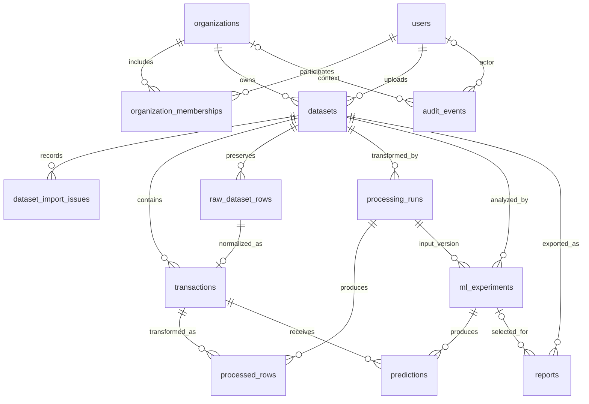

# FinSight: архитектура базы данных

Дата: 02.10.2026. Статус: предложение для обсуждения и самостоятельной реализации.
Основа: BUSINESS_ARCHITECTURE_PLAN.md и текущие User/Alembic. Этот документ уточняет раздел БД бизнес-плана; существующие модели и миграции не изменены. При расхождениях перечисленные здесь решения пока являются предложением, а не реализованным контрактом.

Расширенный целевой словарь колонок: [DATABASE_DATA_DICTIONARY.md](DATABASE_DATA_DICTIONARY.md). Он дополняет этот документ и уточняет денежную точность, привязку predictions к processed_rows и неизменяемые версии курсов. Эти уточнения требуют отдельных будущих миграций.

## 1. Границы и принятые допущения

FinSight анализирует загруженные наборы финансовых операций организаций. Пользователь может состоять в нескольких организациях с разными ролями. Импортированный набор является неизменяемым снимком: исправленный CSV создаёт новый dataset. ML-эксперимент относится к одному dataset и сохраняет происхождение результатов.

Для MVP достаточно одной PostgreSQL, SQLAlchemy и Alembic. По решению владельца сохраняем все слои: оригинальные файлы, сырые записи, нормализованные транзакции, версии обработанных данных, модели и результаты. CSV, модели и большие обработанные артефакты хранятся в файловом storage; БД хранит записи, связи, внутренние ключи, хеши и состояния. Исходный файл сохраняется побайтно: JSONB не заменяет оригинальный CSV.

Пока не выбран конкретный CSV, поддерживаемые поля nullable. Отсутствующая дата, валюта или метка не подменяются выдуманными значениями. Таблица transactions представляет строки аналитического набора, а не бухгалтерскую главную книгу. Одна операция в двух загруженных файлах пока является двумя аналитическими записями; объединять их без договора об идентификаторах источника нельзя.

## 2. Сущности и связи

exchange_rates — общий справочник курсов, не принадлежащий отдельной организации. Связь с финансовыми данными задаётся валютой, датой и источником; сохранённые конвертированные результаты дополнительно фиксируют использованный курс.

## 3. Общие соглашения

- PK: BIGINT GENERATED BY DEFAULT AS IDENTITY. Все FK имеют тот же тип. Текущий User.id ещё INTEGER: переход выполнить отдельной миграцией с проверкой существующей БД.
- Моменты времени: TIMESTAMPTZ; Python datetime с timezone. created_at DEFAULT now(). updated_at обновляется при изменении; один DEFAULT не обновляет его автоматически.
- Деньги: NUMERIC(20,4), в Python Decimal. Суммы разных валют не складываются. Округление для отображения отделено от хранения.
- Статусы и роли: VARCHAR + именованные CHECK. Выбираем один регистр: lowercase.
- JSONB: только изменяемые по структуре данные. FK, состояния, сумма, валюта, дата и поля основных фильтров — отдельные колонки.
- Каждая предметная запись содержит organization_id. Избыточное поле защищается составными FK; оно облегчает фильтрацию, но само по себе не авторизует запрос.
- Ограничения именуем: pk_*, fk_*, uq_*, ck_*; индексы ix_*. UNIQUE уже создаёт индекс: идентичный дополнительный индекс не нужен.
- Ниже поля обязательны, если не отмечены знаком ?. Пустая строка не заменяет NULL.

## 4. Словарь таблиц

### users — учётная запись

| Поля | Тип / правило |
|---|---|
| id | BIGINT PK |
| email | VARCHAR(255), нормализованный логин, UNIQUE |
| password_hash | VARCHAR(255) |
| name, second_name | VARCHAR(50) |
| middle_name? | VARCHAR(50) |
| status | active / blocked / deleted; DEFAULT active |
| created_at, updated_at | TIMESTAMPTZ |
| last_login_at? | TIMESTAMPTZ |

Сохраняем текущие названия name/second_name, чтобы не переименовывать API без необходимости. middle_name действительно nullable и в ORM, и в БД. Email нормализуется одинаково при записи и входе; БД получает CHECK(email = lower(btrim(email))) и UNIQUE(email). Нормализация логина является политикой продукта.

Расширенный профиль из бизнес-плана можно добавлять по необходимости. Не дублировать status полем is_active. Роль owner не хранится в users. Поля даты рождения, пола, рефералов и маркетинга не нужны для текущего финансового сценария.

### organizations — граница доступа

| Поля | Тип / правило |
|---|---|
| id | BIGINT PK |
| name | VARCHAR(200) |
| slug | VARCHAR(100), UNIQUE, нормализованный |
| base_currency | VARCHAR(3), DEFAULT RUB |
| status | active / suspended / archived |
| created_by_user_id | FK users.id |
| created_at, updated_at | TIMESTAMPTZ |

base_currency определяет представление аналитики, а не валюту импортируемых операций.

### organization_memberships — участие и роль

| Поля | Тип / правило |
|---|---|
| id | BIGINT PK |
| organization_id, user_id | FK organizations.id / users.id |
| role | owner / analyst / viewer |
| status | active / disabled |
| created_by_user_id? | FK users.id |
| joined_at, updated_at | TIMESTAMPTZ |

UNIQUE(organization_id, user_id). Повторное добавление восстанавливает существующую связь. Дополнительный индекс (user_id, status, organization_id) обслуживает выбор организаций пользователя.

Последнего активного owner нельзя отключить или понизить. Это межстрочное правило: сервис блокирует строку организации FOR UPDATE, проверяет число активных владельцев и изменяет membership в одной транзакции. Все операции, уменьшающие число владельцев, включая блокировку пользователя, соблюдают этот протокол. При блокировке пользователя проверяются все его активные организации; блокировки берутся в порядке ID.

### datasets — неизменяемый набор и состояние импорта

| Поля | Тип / правило |
|---|---|
| id, organization_id, uploaded_by_user_id | PK; FK organizations / users |
| name, original_filename | VARCHAR(200) / VARCHAR(255) |
| storage_key | TEXT UNIQUE, внутренний ключ |
| file_sha256 | VARCHAR(64), хеш содержимого |
| file_size_bytes | BIGINT >= 0 |
| adapter_name, adapter_version | VARCHAR(80) / VARCHAR(40) |
| schema_json, import_config_json | JSONB object; колонки, mapping, формат дат, timezone, разделитель |
| profile_json | JSONB object DEFAULT {}; качество, доступность полей |
| status | uploaded / validating / importing / ready / invalid / failed |
| archived_at? | TIMESTAMPTZ; архивирование отдельно от состояния обработки |
| total_rows, valid_rows, invalid_rows, imported_rows | BIGINT >= 0 DEFAULT 0 |
| attempt_number | INTEGER >= 0 DEFAULT 0 |
| worker_token? | UUID; идентификатор текущей попытки |
| heartbeat_at? | TIMESTAMPTZ |
| error_code?, error_message? | VARCHAR(100) / TEXT |
| created_at, updated_at, started_at?, completed_at? | TIMESTAMPTZ |

UNIQUE(id, organization_id). CHECK imported_rows <= valid_rows; при ready также valid_rows + invalid_rows = total_rows и imported_rows = valid_rows. total_rows считает записи CSV без заголовка, а не физические строки многострочного CSV.

Хеш файла не UNIQUE: одинаковый файл можно намеренно импортировать с другим mapping. Для обнаружения повтора — индекс (organization_id, file_sha256), предупреждение пользователю. adapter_version и import_config_json после начала импорта неизменяемы.

### dataset_import_issues — диагностика

| Поля | Тип / правило |
|---|---|
| id, organization_id, dataset_id | PK; составной FK на datasets |
| attempt_number | INTEGER |
| source_row_number? | BIGINT > 0; номер записи без заголовка |
| column_name? | VARCHAR(255) |
| code, message | VARCHAR(80) / TEXT |
| created_at | TIMESTAMPTZ |

Сохраняем до 1000 диагностик на попытку; invalid_rows отражает полное число невалидных записей, а не число сообщений. Одна запись может иметь несколько ошибок. Не сохраняем весь исходный ряд в сообщении.

### transactions — канонические строки набора

| Поля | Тип / правило |
|---|---|
| id, organization_id, dataset_id | PK; составной FK на datasets |
| source_row_number | BIGINT > 0 |
| source_transaction_id? | VARCHAR(255); не UNIQUE без контракта источника |
| transaction_time? | TIMESTAMPTZ; только реальная дата/время |
| amount? | NUMERIC(20,4) |
| currency? | VARCHAR(3) |
| category?, counterparty? | VARCHAR(150) |
| source_label? | SMALLINT CHECK IN (0,1) |
| raw_features | JSONB object DEFAULT {}; числовые признаки |
| extra_fields | JSONB object DEFAULT {}; разрешённые дополнительные поля |
| created_at | TIMESTAMPTZ |

UNIQUE(dataset_id, source_row_number); UNIQUE(id, dataset_id, organization_id). Составной FK(dataset_id, organization_id) → datasets(id, organization_id).

raw_features содержит исходные канонические признаки, до scaling; обработка определяется экспериментом. Относительный Time в ML-наборе остаётся признаком, не становится календарной датой. Отрицательная сумма допустима в общей схеме, а конкретный адаптер проверяет правила возвратов/расходов. Точность выше четырёх десятичных знаков должна быть явно отклонена или обработана адаптером до записи, без случайного округления.

### raw_dataset_rows — все исходные записи, включая невалидные

| Поля | Тип / правило |
|---|---|
| id, organization_id, dataset_id | BIGINT; PK и составной FK datasets |
| source_row_number | BIGINT > 0 |
| raw_values | JSONB array строк/NULL в исходном порядке колонок |
| parse_status | parsed / malformed |
| validation_status | pending / valid / invalid |
| created_at | TIMESTAMPTZ |

UNIQUE(dataset_id, source_row_number); UNIQUE(id, dataset_id, organization_id). Заголовки и их порядок фиксируются в datasets.schema_json; массив сохраняет повторяющиеся названия колонок, пробелы и исходные строковые числа. malformed запись может иметь raw_values=NULL; CHECK соответствия parse_status/raw_values. Оригинальный файл остаётся источником точного байтового содержимого и восстанавливает также непарсируемые участки. Для ошибок структуры CSV адаптер сохраняет диагностируемые границы/смещения в schema_json или отдельном манифесте; нельзя обещать надёжную нумерацию логических записей для произвольно повреждённого CSV.

transactions получает обязательный raw_row_id и составной FK(raw_row_id, dataset_id, organization_id) на raw_dataset_rows, а также UNIQUE(raw_row_id). Сырая запись может не породить транзакцию, если не прошла проверку; валидная порождает одну. Полный оригинал и сырые значения неизменяемы. Диагностики содержат ссылку/номер записи, а не копию всех её значений. Доступ к сырым данным проверяет организацию и отдельное разрешение роли; логи и audit не дублируют их содержимое.

### processing_runs — версия преобразования данных

| Поля | Тип / правило |
|---|---|
| id, organization_id, dataset_id, created_by_user_id | BIGINT; PK, составной FK datasets, FK users |
| purpose | cleaning / feature_engineering / ml_preprocessing |
| status | pending / running / succeeded / failed |
| pipeline_version, code_version | VARCHAR(100) |
| config_json | JSONB object; последовательность шагов и параметры |
| split_config_json? | JSONB object; разбиение для ML |
| fitted_parameters_json? | JSONB object; обученные параметры imputer/scaler |
| input_rows, output_rows, excluded_rows | BIGINT >= 0 |
| artifact_key?, artifact_sha256? | TEXT / VARCHAR(64); полный экспорт результата/manifest |
| worker_token?, heartbeat_at? | UUID / TIMESTAMPTZ |
| error_code?, error_message? | VARCHAR(100) / TEXT |
| created_at, started_at?, completed_at? | TIMESTAMPTZ |

UNIQUE(id, dataset_id, organization_id). Каждая новая конфигурация создаёт новый запуск; успешный результат неизменяем. В текущем варианте каждый run начинает с канонических transactions и сохраняет всю последовательность преобразований. Если нужны цепочки run → run, позже добавляется явная ссылка на родительскую версию и проверка отсутствия циклов.

Для ml_preprocessing сначала фиксируется разбиение, затем параметры обучаются только на train и применяются к остальным частям. Глобальный scaler на полном наборе для последующего обучения недопустим. Manifest сохраняет порядок/назначение признаков и идентификаторы строк. Большие матрицы дополнительно сохраняются как файловый артефакт с хешем; успешная версия доступна после проверки его публикации.

### processed_rows — результат конкретной версии для каждой операции

| Поля | Тип / правило |
|---|---|
| id, organization_id, dataset_id, processing_run_id, transaction_id | BIGINT |
| disposition | included / excluded |
| exclusion_reason? | VARCHAR(100) |
| split_role? | train / validation / test / inference |
| values_json | JSONB object; полный результат преобразования строки |
| created_at | TIMESTAMPTZ |

UNIQUE(processing_run_id, transaction_id). Составные FK к processing_runs и transactions гарантируют одинаковые dataset/organization. Храним результат каждой канонической строки, включая исключённые строки с причиной и доступными значениями. output_rows считает included; excluded_rows считает excluded; при succeeded input_rows = output_rows + excluded_rows. Невалидные исходные строки остаются в raw_dataset_rows, даже если transactions для них нет.

Индекс (processing_run_id, transaction_id); отдельный (transaction_id, processing_run_id) обслуживает историю преобразований операции. Числа JSON не проходят через округление денежных колонок; Decimal сериализуется по единому контракту, например строкой с типом в manifest. Переход в succeeded проверяет полноту записей; SQL CHECK одной строки processing_runs этого не доказывает.

### ml_experiments — воспроизводимый запуск

| Поля | Тип / правило |
|---|---|
| id, organization_id, dataset_id, created_by_user_id | PK; составной FK datasets; FK users |
| processing_run_id | BIGINT; составной FK на успешную версию того же dataset/org |
| model_type | linear_regression / logistic_regression / decision_tree_classifier |
| task_type | regression / classification |
| status | pending / running / succeeded / failed |
| target_name | VARCHAR(100) |
| feature_names | JSONB array; порядок признаков |
| hyperparameters, split_config, preprocessing | JSONB object |
| metrics? | JSONB object |
| threshold? | NUMERIC(8,7), 0..1 |
| train_rows?, validation_rows?, test_rows? | BIGINT >= 0 |
| artifact_key?, artifact_sha256? | TEXT / VARCHAR(64) |
| model_version, code_version | VARCHAR(40) / VARCHAR(100) |
| worker_token?, heartbeat_at? | UUID / TIMESTAMPTZ |
| error_code?, error_message? | VARCHAR(100) / TEXT |
| created_at, started_at?, completed_at? | TIMESTAMPTZ |

UNIQUE(id, dataset_id, organization_id); UNIQUE(id, dataset_id, organization_id, task_type) для проверки вида прогноза. CHECK соответствия model_type/task_type. Для classification threshold обязателен; для regression он NULL.

split_config хранит алгоритм разбиения и seed; версия кода фиксирует его реализацию. Список строк разбиения или его воспроизводимый manifest хранится в артефакте. preprocessing содержит обученные параметры scaler/imputer в артефакте, а БД — конфигурацию и ссылку. Обучение scaler выполняется только на train. Успех означает завершённое обучение, публикацию проверенного артефакта и полного набора прогнозов; метрики могут отсутствовать, если оценка математически не определена, с причиной в JSON.

processing_run_id обязателен: даже преобразование «без изменений» создаёт версию с явным контрактом. Источник истины для разбиения и preprocessing — processing_runs и processed_rows; поля split_config/preprocessing эксперимента являются проверяемым неизменяемым снимком, не независимо изменяемой конфигурацией. Обучение читает только included processed_rows выбранной версии. Прогноз сохраняется для допустимых строк этой версии; полнота считается по её manifest, а не автоматически по всем transactions dataset.

### predictions — результат модели для строки

| Поля | Тип / правило |
|---|---|
| id, organization_id, dataset_id | BIGINT |
| transaction_id, experiment_id | BIGINT |
| task_type | classification / regression |
| split_role | train / validation / test / inference |
| risk_probability? | DOUBLE PRECISION, CHECK 0..1 |
| predicted_label? | SMALLINT CHECK IN (0,1) |
| predicted_value? | DOUBLE PRECISION |
| residual? | DOUBLE PRECISION, actual - predicted |
| explanation_json? | JSONB object |
| created_at | TIMESTAMPTZ |

UNIQUE(experiment_id, transaction_id). FK(transaction_id, dataset_id, organization_id) → transactions(id, dataset_id, organization_id). FK(experiment_id, dataset_id, organization_id, task_type) → ml_experiments(id, dataset_id, organization_id, task_type).

CHECK двух допустимых форм: classification требует risk_probability/predicted_label и NULL predicted_value/residual; regression требует predicted_value и NULL risk_probability/predicted_label. Численные результаты проверяются на конечность в сервисе и ограничениями БД против NaN/Infinity.

predicted_value вместо expected_amount позволяет прогнозировать любую согласованную числовую цель. Это оценка ML, поэтому FLOAT допустим; реальные деньги остаются Decimal/NUMERIC. relative_deviation вычисляется при чтении с зафиксированным epsilon. source_label никогда не перезаписывается прогнозом. split_role позволяет отличить оценку на test от предсказаний для тренировочных строк.

### reports — воспроизводимая выгрузка

| Поля | Тип / правило |
|---|---|
| id, organization_id, dataset_id, requested_by_user_id | PK; FK datasets/users |
| experiment_id? | FK на эксперимент того же dataset/организации |
| type | filtered_transactions / suspicious_transactions / dataset_summary |
| status | pending / running / succeeded / failed |
| filters_json, presentation_json | JSONB object |
| storage_key?, file_sha256? | TEXT UNIQUE / VARCHAR(64) |
| row_count?, file_size_bytes? | BIGINT >= 0 |
| worker_token?, heartbeat_at? | UUID / TIMESTAMPTZ |
| error_code?, error_message? | VARCHAR(100) / TEXT |
| created_at, started_at?, completed_at? | TIMESTAMPTZ |

Составные FK к datasets и ml_experiments сохраняют совпадение контекста. suspicious_transactions требует experiment_id классификатора — вид модели проверяется сервисом. Фильтры сохраняют сортировку, порог, выбранные колонки и версию формата. presentation_json фиксирует валюту представления и использованные ID курсов, если суммы конвертировались.

CHECK: succeeded требует storage_key, file_sha256, row_count, file_size_bytes, completed_at. Запись хеша не отменяет проверку существования файла сервисом. Скачивание каждый раз проверяет текущие права пользователя.

### audit_events — история значимых действий

| Поля | Тип / правило |
|---|---|
| id | BIGINT PK |
| organization_id?, actor_user_id? | FK organizations/users |
| action | VARCHAR(80) |
| resource_type, resource_id? | VARCHAR(50) / BIGINT |
| details_json | JSONB object DEFAULT {} |
| created_at | TIMESTAMPTZ |

События только добавляются. resource_id является исторической ссылкой без универсального FK на разные таблицы. Не писать пароли, токены и содержимое CSV. Значимые изменения предметных данных и их audit event коммитятся вместе. Обычные чтения и HTTP-логи остаются в прикладном логировании.

### exchange_rates — общий кэш курсов, поздний этап

| Поля | Тип / правило |
|---|---|
| id | BIGINT PK |
| provider, currency, quote_currency | VARCHAR(30) / VARCHAR(3) / VARCHAR(3) |
| rate_date | DATE |
| nominal, value | NUMERIC(20,4) / NUMERIC(20,8), > 0 |
| fetched_at, source_url | TIMESTAMPTZ / TEXT |

UNIQUE(provider, currency, quote_currency, rate_date). Пересчёт: amount × value / nominal. При выборе последнего опубликованного курса не позднее даты операции показывать его фактическую дату. Если сохранённый курс может исправляться провайдером, воспроизводимая выгрузка фиксирует также nominal/value, а не только ID изменяемой строки. Политика обновления курса должна быть определена до реализации интеграции.

## 5. Индексы под первые запросы

| Запрос | Индекс |
|---|---|
| Организации текущего пользователя | memberships(user_id, status, organization_id) |
| Наборы организации, новые первыми | datasets(organization_id, created_at DESC, id DESC) |
| Поиск повторного файла | datasets(organization_id, file_sha256) |
| Список операций dataset | transactions(dataset_id, id) |
| Диапазон даты/суммы | transactions(dataset_id, transaction_time, id); transactions(dataset_id, amount, id), по мере появления фильтров |
| Ошибки попытки | dataset_import_issues(dataset_id, attempt_number, source_row_number) |
| Запуски по dataset | ml_experiments(dataset_id, created_at DESC, id DESC) |
| Риск выбранного эксперимента | predictions(experiment_id, risk_probability DESC, transaction_id DESC) WHERE task_type='classification' |
| Отчёты организации | reports(organization_id, created_at DESC, id DESC) |
| Журнал организации | audit_events(organization_id, created_at DESC, id DESC) |

Проверить индексы дочерних FK для удаления/обновления родителей: PostgreSQL не создаёт их автоматически. Некоторые из перечисленных индексов уже покрывают FK своим левым префиксом. GIN на каждый JSONB заранее не создаём. Очереди pending получают частичные индексы только при реализации DB-based worker.

Пагинация большого списка — по курсору. Для риска курсор включает probability и transaction_id; query всегда фиксирует experiment_id. Обычный индекс probability по dataset смешал бы результаты нескольких моделей. При сортировке nullable-полей нужно явно определить NULLS FIRST/LAST и формат курсора.

## 6. Импорт, фоновые задачи и транзакции

1. Сервис пишет загрузку во временный файл, проверяет размер/хеш, публикует по серверному storage_key, создаёт dataset. Ошибка между файлом и БД устраняется очисткой невостребованных файлов; файловая система и PostgreSQL не имеют общей атомарной транзакции.
2. Worker атомарно захватывает uploaded/failed dataset, выдаёт новый worker_token и увеличивает attempt_number. Новый импорт из failed заново проходит validation.
3. После остановки предыдущего worker новая попытка продолжает сохранять оригинал и уже прочитанные raw_dataset_rows; их повторная вставка по номеру проверяет совпадение значений. Производные частичные transactions пересоздаются. Сырая запись не перезаписывается новым разбором: смена адаптера требует нового dataset. Обучение и отчёты для failed/importing dataset запрещены.
4. Каждый chunk вставляет валидные записи и обновляет счётчики в одной транзакции. Worker держит блокировку dataset при проверке token и записи chunk: старый процесс не может продолжить запись после нового захвата. UNIQUE(dataset_id, source_row_number) — дополнительная защита, а не полный протокол retry.
5. После проверки финальных счётчиков набор становится ready. До ready строки скрыты от аналитики/API. После ready изменять строки запрещает сервис.
6. ML и отчёт используют аналогичный захват/token; публикуют файлы и финальный статус. Частичные predictions недоступны до succeeded; retry очищает результаты неуспешной попытки. Сбойный worker определяется по heartbeat, а перезапуск fencing token предотвращает запись устаревшего процесса.

Не держать SQL-транзакцию открытой во время чтения всего CSV или обучения. На каждый chunk/переход состояния — короткая транзакция. Исключение при операции откатывает всю её транзакцию.

Достаточно отдельного управляемого worker-процесса, читающего задания из состояния БД. Если начать с задачи внутри FastAPI, при старте нужна проверка зависших задач и ограничение одновременного обучения. Очередь Redis/Celery не обязательна для MVP. Таблица job_attempts понадобится, когда потребуется полная история попыток, а не только текущая попытка и диагностики.

## 7. Доступ, удаление и файловое хранение

Каждый запрос получает organization_id из проверенного активного membership; дополнительно проверяет user.status и organization.status. Составной FK предотвращает смешение организаций при записи, но не заменяет проверку прав при чтении. Viewer читает; analyst импортирует, анализирует и выгружает; owner управляет участниками.

Для MVP прикладной доступ обеспечивает service/repository. RLS можно добавить отдельным этапом защиты, когда определены роли соединения и транзакционная установка tenant context; нельзя считать RLS работающим просто по наличию organization_id.

Обычное удаление — архивирование dataset/organization. Для предметных FK используем RESTRICT/NO ACTION; каскады без явного сценария не включаем. Пользователь блокируется или обезличивается, чтобы сохранить авторство. actor_user_id в audit может использовать SET NULL, если физическое удаление users вообще разрешено; остальные ссылки ограничивают его.

По текущему запросу исходные и производные данные сохраняются без автоматического удаления успешных версий. Физическая очистка — только отдельный явно запрошенный сценарий: отчёты → прогнозы → эксперименты → processed_rows → processing_runs → ошибки → транзакции → raw_dataset_rows → dataset, затем файлы. Ссылки отчётов на эксперименты учитываются. Сначала фиксируется удаление в БД, затем повторяемая очистка storage; временные и невостребованные файлы можно убирать после установленного срока, не затрагивая сохранённые версии.

Бэкап включает PostgreSQL и storage с согласованным снимком и манифестом хешей. Восстановление проверяется на отдельной среде. Retention и максимальный размер CSV задаются конфигурацией до публичного запуска.

## 8. Последовательность реализации

1. Проверить фактическую users и alembic_version. Корневая существующая миграция изменяет уже существующую users вместо её создания: текущая цепочка не описывает пустую БД. Последняя безусловно добавляет identity и PK — до применения проверить существующие ограничения. Уже применённые revisions не переписывать вслепую.
2. Определить воспроизводимую исходную миграцию для чистого стенда и безопасный путь текущей БД. Исправить типы datetime, nullable middle_name, defaults, нормализацию email и единый status; согласовать INTEGER/BIGINT.
3. Добавить organizations/memberships; проверить регистрацию владельца и конкурирующее изменение ролей.
4. Добавить datasets/issues/transactions; реализовать один адаптер, chunk import и retry.
5. Добавить processing_runs/processed_rows, затем experiments/predictions; проверить сохранение всех слоёв, dataset/org/task consistency и воспроизводимость. raw_dataset_rows вводится вместе с импортом из шага 4, до первой реальной загрузки.
6. Добавить reports/audit; затем exchange_rates при необходимости.

В модели SQLAlchemy составные связи задаются ForeignKeyConstraint и UniqueConstraint. Структурные JSON-формы проверяются CHECK(jsonb_typeof(...)); конкретное содержимое валидируется сервисом. Переходы состояния и правила membership нельзя выразить обычным CHECK одной строки.

Проверки на отдельной PostgreSQL: миграции с нуля; несовпадение tenant/dataset в FK; уникальность email/строки/прогноза; неверные формы prediction; конкурирующая потеря последнего owner; падение и retry импорта; запрет аналитики частичного набора; полные результаты выбранного эксперимента; отчёт с фиксированными фильтрами. Это план будущих тестов, проверки схемы сейчас не запускались.

## 9. Что ещё зависит от решения о продукте

- Первый CSV определит обязательность полей, адаптер, признаки и допустимую цель регрессии.
- Если нужна аналитика организации сразу по нескольким файлам, потребуется контракт дедупликации операций и источников; простой SUM по всем datasets будет давать двойной счёт.
- Применение обученной модели к другому dataset потребует разделить training experiment и inference run. Текущий MVP сознательно анализирует тот же dataset, отдельно отмечая test/train.
- Долгие сессии с refresh token потребуют auth_sessions; публичные приглашения — organization_invitations. Добавлять эти таблицы при появлении соответствующих сценариев.
- Счета, контрагенты-справочники и бухгалтерские проводки нужны только при переходе от анализа CSV к управлению финансами.

Итоговый объём текущей модели после решения хранить все слои: 13 таблиц основного сценария и 1 таблица курсов. Расширения вводятся по сценариям, а не ради количества таблиц.
