# FinSight: отдельная схема каждой таблицы

Дата: 02.10.2026; авторизация дополнена 03.10.2026. Проект, без применения миграций.

Всего 16 таблиц. Сессии и история refresh-токенов описаны в AUTH_ARCHITECTURE.md.

PK — первичный ключ; FK — внешний ключ; UK — уникальное поле. NULL — допускается отсутствие значения; Б — основной контракт; Р — расширение. Последний столбец каждой схемы кратко объясняет назначение колонки. Остальные поля NOT NULL. NUMERIC_28_8 означает SQL NUMERIC(28,8); DOUBLE_PRECISION означает DOUBLE PRECISION. CHECK, составные FK/UNIQUE и правила обработки описаны в DATABASE_DATA_DICTIONARY.md.

## 1. users — аккаунт и настройки

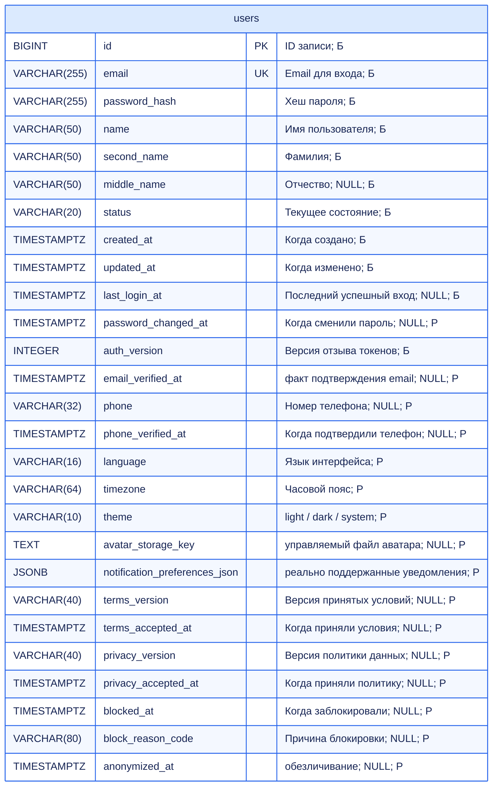
```mermaid
---
config:
  theme: base
  themeVariables:
    primaryColor: "#dbeafe"
    primaryBorderColor: "#2563eb"
    primaryTextColor: "#172554"
---
erDiagram
    users {
        BIGINT id PK "ID записи; Б"
        VARCHAR(255) email UK "Email для входа; Б"
        VARCHAR(255) password_hash "Хеш пароля; Б"
        VARCHAR(50) name "Имя пользователя; Б"
        VARCHAR(50) second_name "Фамилия; Б"
        VARCHAR(50) middle_name "Отчество; NULL; Б"
        VARCHAR(20) status "Текущее состояние; Б"
        TIMESTAMPTZ created_at "Когда создано; Б"
        TIMESTAMPTZ updated_at "Когда изменено; Б"
        TIMESTAMPTZ last_login_at "Последний успешный вход; NULL; Б"
        TIMESTAMPTZ password_changed_at "Когда сменили пароль; NULL; Р"
        INTEGER auth_version "Версия отзыва токенов; Б"
        TIMESTAMPTZ email_verified_at "факт подтверждения email; NULL; Р"
        VARCHAR(32) phone "Номер телефона; NULL; Р"
        TIMESTAMPTZ phone_verified_at "Когда подтвердили телефон; NULL; Р"
        VARCHAR(16) language "Язык интерфейса; Р"
        VARCHAR(64) timezone "Часовой пояс; Р"
        VARCHAR(10) theme "light / dark / system; Р"
        TEXT avatar_storage_key "управляемый файл аватара; NULL; Р"
        JSONB notification_preferences_json "реально поддержанные уведомления; Р"
        VARCHAR(40) terms_version "Версия принятых условий; NULL; Р"
        TIMESTAMPTZ terms_accepted_at "Когда приняли условия; NULL; Р"
        VARCHAR(40) privacy_version "Версия политики данных; NULL; Р"
        TIMESTAMPTZ privacy_accepted_at "Когда приняли политику; NULL; Р"
        TIMESTAMPTZ blocked_at "Когда заблокировали; NULL; Р"
        VARCHAR(80) block_reason_code "Причина блокировки; NULL; Р"
        TIMESTAMPTZ anonymized_at "обезличивание; NULL; Р"
    }
```

## 2. organizations — организация

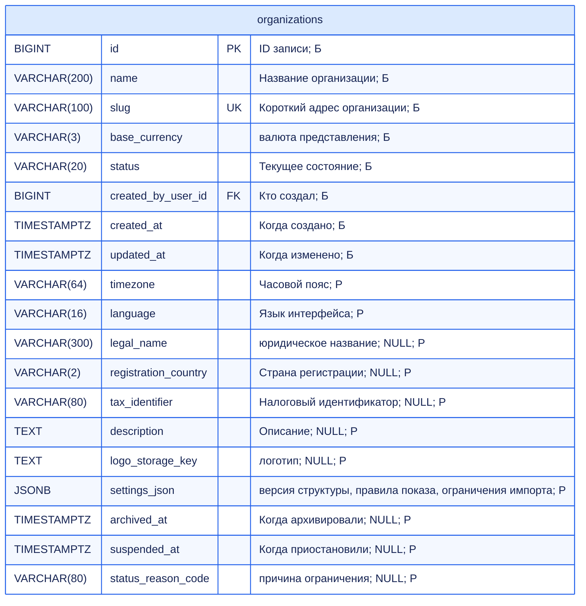
```mermaid
---
config:
  theme: base
  themeVariables:
    primaryColor: "#dbeafe"
    primaryBorderColor: "#2563eb"
    primaryTextColor: "#172554"
---
erDiagram
    organizations {
        BIGINT id PK "ID записи; Б"
        VARCHAR(200) name "Название организации; Б"
        VARCHAR(100) slug UK "Короткий адрес организации; Б"
        VARCHAR(3) base_currency "валюта представления; Б"
        VARCHAR(20) status "Текущее состояние; Б"
        BIGINT created_by_user_id FK "Кто создал; Б"
        TIMESTAMPTZ created_at "Когда создано; Б"
        TIMESTAMPTZ updated_at "Когда изменено; Б"
        VARCHAR(64) timezone "Часовой пояс; Р"
        VARCHAR(16) language "Язык интерфейса; Р"
        VARCHAR(300) legal_name "юридическое название; NULL; Р"
        VARCHAR(2) registration_country "Страна регистрации; NULL; Р"
        VARCHAR(80) tax_identifier "Налоговый идентификатор; NULL; Р"
        TEXT description "Описание; NULL; Р"
        TEXT logo_storage_key "логотип; NULL; Р"
        JSONB settings_json "версия структуры, правила показа, ограничения импорта; Р"
        TIMESTAMPTZ archived_at "Когда архивировали; NULL; Р"
        TIMESTAMPTZ suspended_at "Когда приостановили; NULL; Р"
        VARCHAR(80) status_reason_code "причина ограничения; NULL; Р"
    }
```

## 3. organization_memberships — роль конкретного пользователя в компании

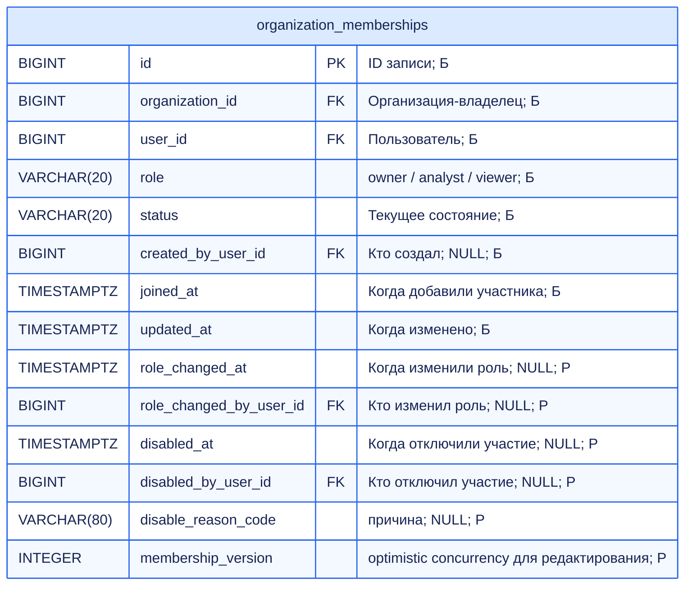
```mermaid
---
config:
  theme: base
  themeVariables:
    primaryColor: "#dbeafe"
    primaryBorderColor: "#2563eb"
    primaryTextColor: "#172554"
---
erDiagram
    organization_memberships {
        BIGINT id PK "ID записи; Б"
        BIGINT organization_id FK "Организация-владелец; Б"
        BIGINT user_id FK "Пользователь; Б"
        VARCHAR(20) role "owner / analyst / viewer; Б"
        VARCHAR(20) status "Текущее состояние; Б"
        BIGINT created_by_user_id FK "Кто создал; NULL; Б"
        TIMESTAMPTZ joined_at "Когда добавили участника; Б"
        TIMESTAMPTZ updated_at "Когда изменено; Б"
        TIMESTAMPTZ role_changed_at "Когда изменили роль; NULL; Р"
        BIGINT role_changed_by_user_id FK "Кто изменил роль; NULL; Р"
        TIMESTAMPTZ disabled_at "Когда отключили участие; NULL; Р"
        BIGINT disabled_by_user_id FK "Кто отключил участие; NULL; Р"
        VARCHAR(80) disable_reason_code "причина; NULL; Р"
        INTEGER membership_version "optimistic concurrency для редактирования; Р"
    }
```

## 4. datasets — оригинал и итог импорта

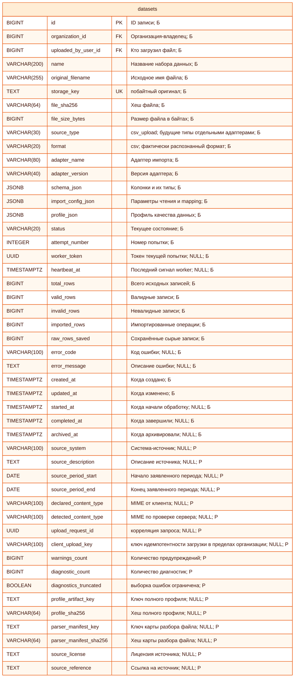
```mermaid
---
config:
  theme: base
  themeVariables:
    primaryColor: "#ffedd5"
    primaryBorderColor: "#ea580c"
    primaryTextColor: "#431407"
---
erDiagram
    datasets {
        BIGINT id PK "ID записи; Б"
        BIGINT organization_id FK "Организация-владелец; Б"
        BIGINT uploaded_by_user_id FK "Кто загрузил файл; Б"
        VARCHAR(200) name "Название набора данных; Б"
        VARCHAR(255) original_filename "Исходное имя файла; Б"
        TEXT storage_key UK "побайтный оригинал; Б"
        VARCHAR(64) file_sha256 "Хеш файла; Б"
        BIGINT file_size_bytes "Размер файла в байтах; Б"
        VARCHAR(30) source_type "csv_upload; будущие типы отдельными адаптерами; Б"
        VARCHAR(20) format "csv; фактически распознанный формат; Б"
        VARCHAR(80) adapter_name "Адаптер импорта; Б"
        VARCHAR(40) adapter_version "Версия адаптера; Б"
        JSONB schema_json "Колонки и их типы; Б"
        JSONB import_config_json "Параметры чтения и mapping; Б"
        JSONB profile_json "Профиль качества данных; Б"
        VARCHAR(20) status "Текущее состояние; Б"
        INTEGER attempt_number "Номер попытки; Б"
        UUID worker_token "Токен текущей попытки; NULL; Б"
        TIMESTAMPTZ heartbeat_at "Последний сигнал worker; NULL; Б"
        BIGINT total_rows "Всего исходных записей; Б"
        BIGINT valid_rows "Валидные записи; Б"
        BIGINT invalid_rows "Невалидные записи; Б"
        BIGINT imported_rows "Импортированные операции; Б"
        BIGINT raw_rows_saved "Сохранённые сырые записи; Б"
        VARCHAR(100) error_code "Код ошибки; NULL; Б"
        TEXT error_message "Описание ошибки; NULL; Б"
        TIMESTAMPTZ created_at "Когда создано; Б"
        TIMESTAMPTZ updated_at "Когда изменено; Б"
        TIMESTAMPTZ started_at "Когда начали обработку; NULL; Б"
        TIMESTAMPTZ completed_at "Когда завершили; NULL; Б"
        TIMESTAMPTZ archived_at "Когда архивировали; NULL; Б"
        VARCHAR(100) source_system "Система-источник; NULL; Р"
        TEXT source_description "Описание источника; NULL; Р"
        DATE source_period_start "Начало заявленного периода; NULL; Р"
        DATE source_period_end "Конец заявленного периода; NULL; Р"
        VARCHAR(100) declared_content_type "MIME от клиента; NULL; Р"
        VARCHAR(100) detected_content_type "MIME по проверке сервера; NULL; Р"
        UUID upload_request_id "корреляция запроса; NULL; Р"
        VARCHAR(100) client_upload_key "ключ идемпотентности загрузки в пределах организации; NULL; Р"
        BIGINT warnings_count "Количество предупреждений; Р"
        BIGINT diagnostic_count "Количество диагностик; Р"
        BOOLEAN diagnostics_truncated "выборка ошибок ограничена; Р"
        TEXT profile_artifact_key "Ключ полного профиля; NULL; Р"
        VARCHAR(64) profile_sha256 "Хеш полного профиля; NULL; Р"
        TEXT parser_manifest_key "Ключ карты разбора файла; NULL; Р"
        VARCHAR(64) parser_manifest_sha256 "Хеш карты разбора файла; NULL; Р"
        TEXT source_license "Лицензия источника; NULL; Р"
        TEXT source_reference "Ссылка на источник; NULL; Р"
    }
```

## 5. raw_dataset_rows — точные исходные значения

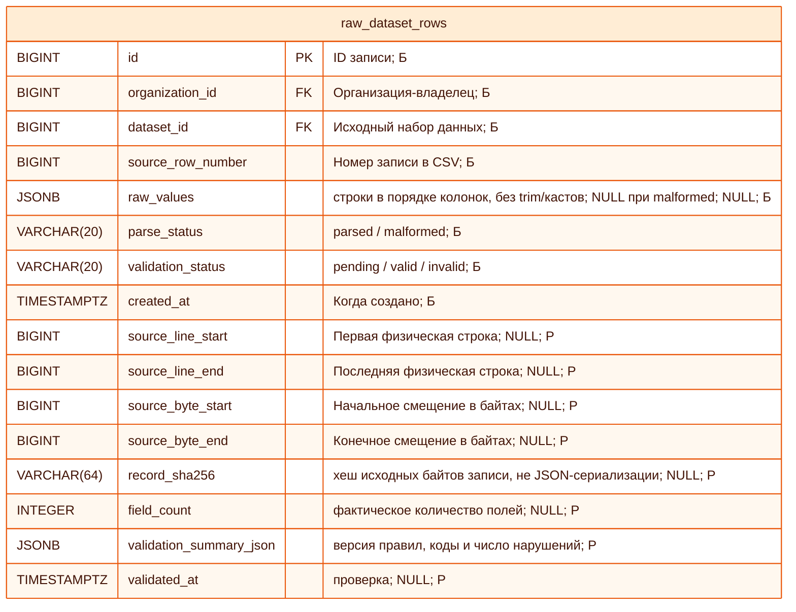
```mermaid
---
config:
  theme: base
  themeVariables:
    primaryColor: "#ffedd5"
    primaryBorderColor: "#ea580c"
    primaryTextColor: "#431407"
---
erDiagram
    raw_dataset_rows {
        BIGINT id PK "ID записи; Б"
        BIGINT organization_id FK "Организация-владелец; Б"
        BIGINT dataset_id FK "Исходный набор данных; Б"
        BIGINT source_row_number "Номер записи в CSV; Б"
        JSONB raw_values "строки в порядке колонок, без trim/кастов; NULL при malformed; NULL; Б"
        VARCHAR(20) parse_status "parsed / malformed; Б"
        VARCHAR(20) validation_status "pending / valid / invalid; Б"
        TIMESTAMPTZ created_at "Когда создано; Б"
        BIGINT source_line_start "Первая физическая строка; NULL; Р"
        BIGINT source_line_end "Последняя физическая строка; NULL; Р"
        BIGINT source_byte_start "Начальное смещение в байтах; NULL; Р"
        BIGINT source_byte_end "Конечное смещение в байтах; NULL; Р"
        VARCHAR(64) record_sha256 "хеш исходных байтов записи, не JSON-сериализации; NULL; Р"
        INTEGER field_count "фактическое количество полей; NULL; Р"
        JSONB validation_summary_json "версия правил, коды и число нарушений; Р"
        TIMESTAMPTZ validated_at "проверка; NULL; Р"
    }
```

## 6. dataset_import_issues — подробная диагностика

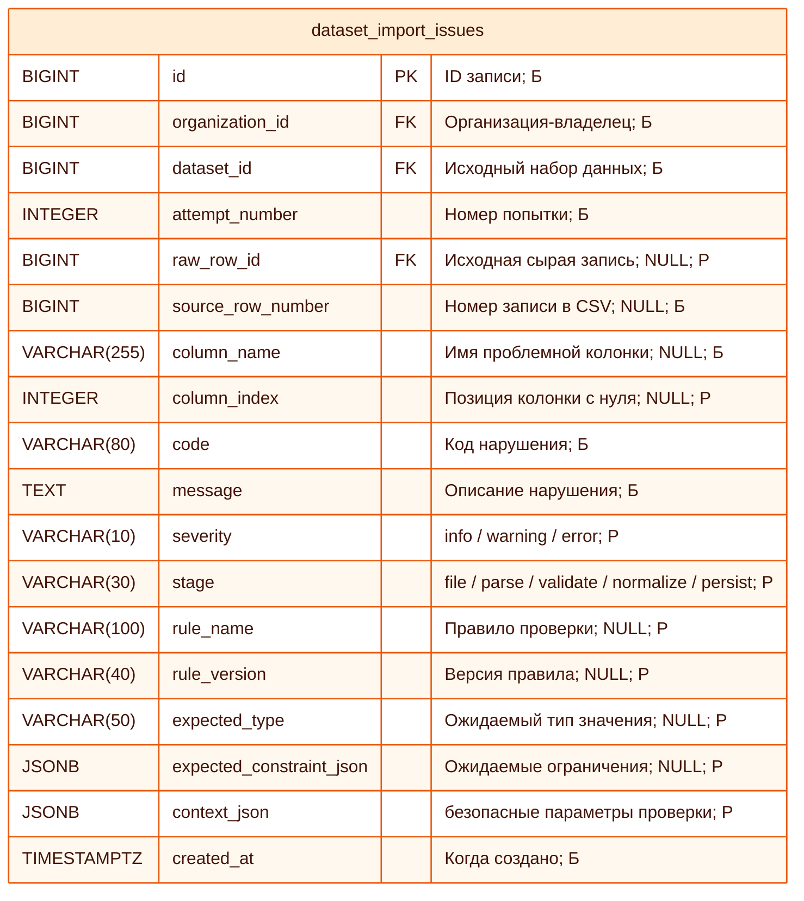
```mermaid
---
config:
  theme: base
  themeVariables:
    primaryColor: "#ffedd5"
    primaryBorderColor: "#ea580c"
    primaryTextColor: "#431407"
---
erDiagram
    dataset_import_issues {
        BIGINT id PK "ID записи; Б"
        BIGINT organization_id FK "Организация-владелец; Б"
        BIGINT dataset_id FK "Исходный набор данных; Б"
        INTEGER attempt_number "Номер попытки; Б"
        BIGINT raw_row_id FK "Исходная сырая запись; NULL; Р"
        BIGINT source_row_number "Номер записи в CSV; NULL; Б"
        VARCHAR(255) column_name "Имя проблемной колонки; NULL; Б"
        INTEGER column_index "Позиция колонки с нуля; NULL; Р"
        VARCHAR(80) code "Код нарушения; Б"
        TEXT message "Описание нарушения; Б"
        VARCHAR(10) severity "info / warning / error; Р"
        VARCHAR(30) stage "file / parse / validate / normalize / persist; Р"
        VARCHAR(100) rule_name "Правило проверки; NULL; Р"
        VARCHAR(40) rule_version "Версия правила; NULL; Р"
        VARCHAR(50) expected_type "Ожидаемый тип значения; NULL; Р"
        JSONB expected_constraint_json "Ожидаемые ограничения; NULL; Р"
        JSONB context_json "безопасные параметры проверки; Р"
        TIMESTAMPTZ created_at "Когда создано; Б"
    }
```

## 7. transactions — канонический снимок операции

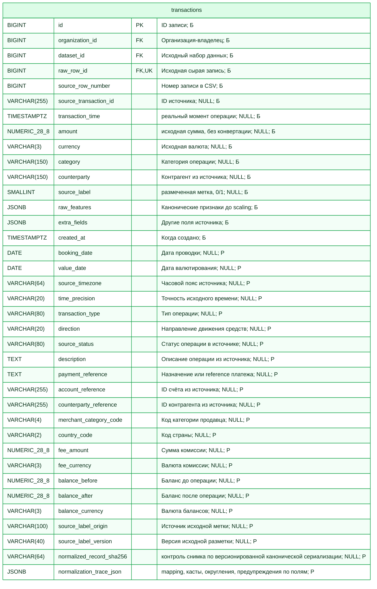
```mermaid
---
config:
  theme: base
  themeVariables:
    primaryColor: "#dcfce7"
    primaryBorderColor: "#16a34a"
    primaryTextColor: "#052e16"
---
erDiagram
    transactions {
        BIGINT id PK "ID записи; Б"
        BIGINT organization_id FK "Организация-владелец; Б"
        BIGINT dataset_id FK "Исходный набор данных; Б"
        BIGINT raw_row_id FK, UK "Исходная сырая запись; Б"
        BIGINT source_row_number "Номер записи в CSV; Б"
        VARCHAR(255) source_transaction_id "ID источника; NULL; Б"
        TIMESTAMPTZ transaction_time "реальный момент операции; NULL; Б"
        NUMERIC_28_8 amount "исходная сумма, без конвертации; NULL; Б"
        VARCHAR(3) currency "Исходная валюта; NULL; Б"
        VARCHAR(150) category "Категория операции; NULL; Б"
        VARCHAR(150) counterparty "Контрагент из источника; NULL; Б"
        SMALLINT source_label "размеченная метка, 0/1; NULL; Б"
        JSONB raw_features "Канонические признаки до scaling; Б"
        JSONB extra_fields "Другие поля источника; Б"
        TIMESTAMPTZ created_at "Когда создано; Б"
        DATE booking_date "Дата проводки; NULL; Р"
        DATE value_date "Дата валютирования; NULL; Р"
        VARCHAR(64) source_timezone "Часовой пояс источника; NULL; Р"
        VARCHAR(20) time_precision "Точность исходного времени; NULL; Р"
        VARCHAR(80) transaction_type "Тип операции; NULL; Р"
        VARCHAR(20) direction "Направление движения средств; NULL; Р"
        VARCHAR(80) source_status "Статус операции в источнике; NULL; Р"
        TEXT description "Описание операции из источника; NULL; Р"
        TEXT payment_reference "Назначение или reference платежа; NULL; Р"
        VARCHAR(255) account_reference "ID счёта из источника; NULL; Р"
        VARCHAR(255) counterparty_reference "ID контрагента из источника; NULL; Р"
        VARCHAR(4) merchant_category_code "Код категории продавца; NULL; Р"
        VARCHAR(2) country_code "Код страны; NULL; Р"
        NUMERIC_28_8 fee_amount "Сумма комиссии; NULL; Р"
        VARCHAR(3) fee_currency "Валюта комиссии; NULL; Р"
        NUMERIC_28_8 balance_before "Баланс до операции; NULL; Р"
        NUMERIC_28_8 balance_after "Баланс после операции; NULL; Р"
        VARCHAR(3) balance_currency "Валюта балансов; NULL; Р"
        VARCHAR(100) source_label_origin "Источник исходной метки; NULL; Р"
        VARCHAR(40) source_label_version "Версия исходной разметки; NULL; Р"
        VARCHAR(64) normalized_record_sha256 "контроль снимка по версионированной канонической сериализации; NULL; Р"
        JSONB normalization_trace_json "mapping, касты, округления, предупреждения по полям; Р"
    }
```

## 8. processing_runs — полный контракт обработки

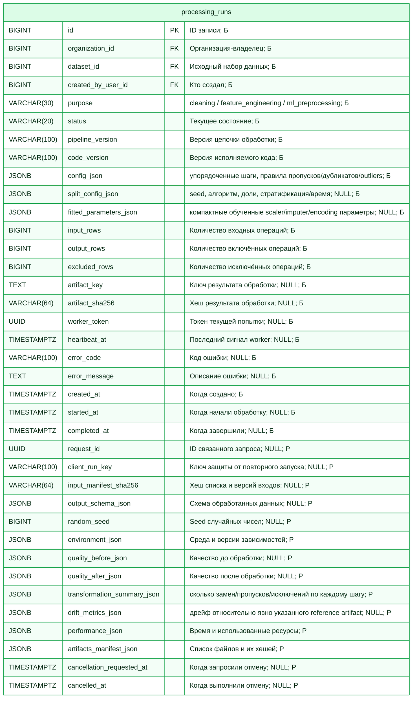
```mermaid
---
config:
  theme: base
  themeVariables:
    primaryColor: "#dcfce7"
    primaryBorderColor: "#16a34a"
    primaryTextColor: "#052e16"
---
erDiagram
    processing_runs {
        BIGINT id PK "ID записи; Б"
        BIGINT organization_id FK "Организация-владелец; Б"
        BIGINT dataset_id FK "Исходный набор данных; Б"
        BIGINT created_by_user_id FK "Кто создал; Б"
        VARCHAR(30) purpose "cleaning / feature_engineering / ml_preprocessing; Б"
        VARCHAR(20) status "Текущее состояние; Б"
        VARCHAR(100) pipeline_version "Версия цепочки обработки; Б"
        VARCHAR(100) code_version "Версия исполняемого кода; Б"
        JSONB config_json "упорядоченные шаги, правила пропусков/дубликатов/outliers; Б"
        JSONB split_config_json "seed, алгоритм, доли, стратификация/время; NULL; Б"
        JSONB fitted_parameters_json "компактные обученные scaler/imputer/encoding параметры; NULL; Б"
        BIGINT input_rows "Количество входных операций; Б"
        BIGINT output_rows "Количество включённых операций; Б"
        BIGINT excluded_rows "Количество исключённых операций; Б"
        TEXT artifact_key "Ключ результата обработки; NULL; Б"
        VARCHAR(64) artifact_sha256 "Хеш результата обработки; NULL; Б"
        UUID worker_token "Токен текущей попытки; NULL; Б"
        TIMESTAMPTZ heartbeat_at "Последний сигнал worker; NULL; Б"
        VARCHAR(100) error_code "Код ошибки; NULL; Б"
        TEXT error_message "Описание ошибки; NULL; Б"
        TIMESTAMPTZ created_at "Когда создано; Б"
        TIMESTAMPTZ started_at "Когда начали обработку; NULL; Б"
        TIMESTAMPTZ completed_at "Когда завершили; NULL; Б"
        UUID request_id "ID связанного запроса; NULL; Р"
        VARCHAR(100) client_run_key "Ключ защиты от повторного запуска; NULL; Р"
        VARCHAR(64) input_manifest_sha256 "Хеш списка и версий входов; NULL; Р"
        JSONB output_schema_json "Схема обработанных данных; NULL; Р"
        BIGINT random_seed "Seed случайных чисел; NULL; Р"
        JSONB environment_json "Среда и версии зависимостей; Р"
        JSONB quality_before_json "Качество до обработки; NULL; Р"
        JSONB quality_after_json "Качество после обработки; NULL; Р"
        JSONB transformation_summary_json "сколько замен/пропусков/исключений по каждому шагу; Р"
        JSONB drift_metrics_json "дрейф относительно явно указанного reference artifact; NULL; Р"
        JSONB performance_json "Время и использованные ресурсы; Р"
        JSONB artifacts_manifest_json "Список файлов и их хешей; Р"
        TIMESTAMPTZ cancellation_requested_at "Когда запросили отмену; NULL; Р"
        TIMESTAMPTZ cancelled_at "Когда выполнили отмену; NULL; Р"
    }
```

## 9. processed_rows — результат обработки и объяснение изменений

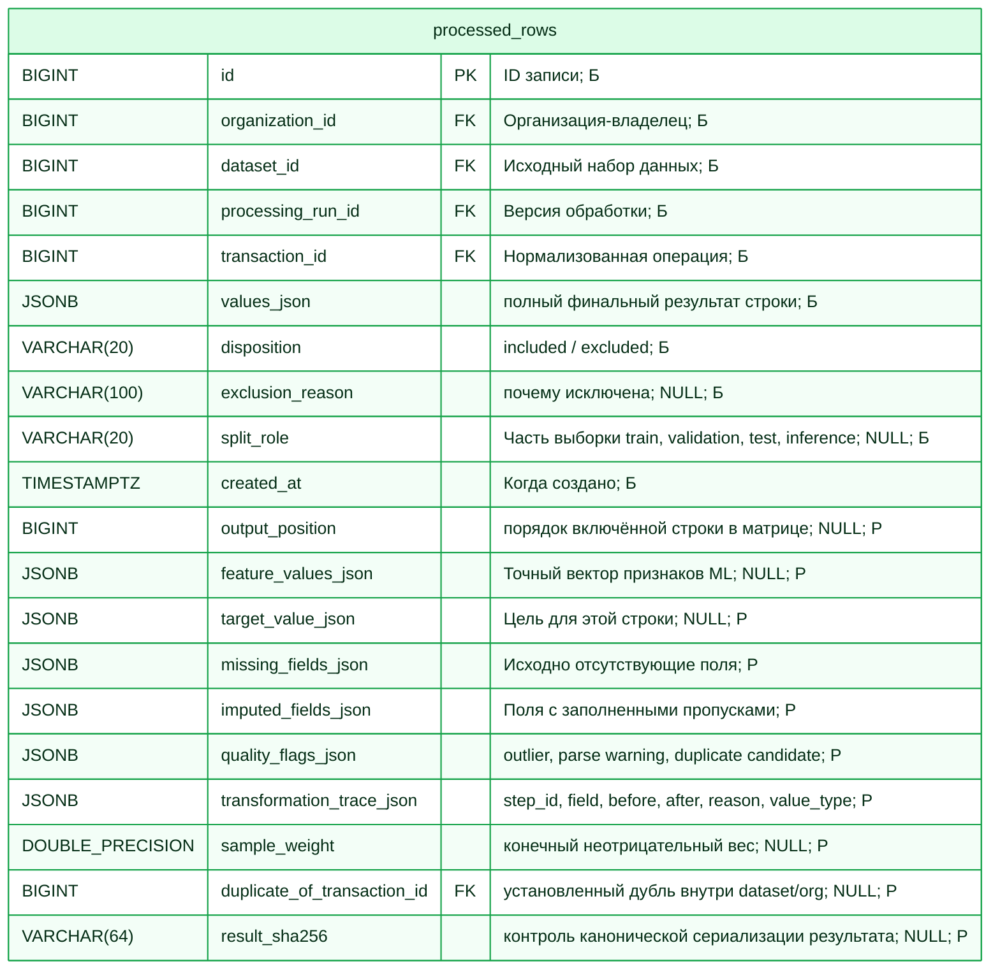
```mermaid
---
config:
  theme: base
  themeVariables:
    primaryColor: "#dcfce7"
    primaryBorderColor: "#16a34a"
    primaryTextColor: "#052e16"
---
erDiagram
    processed_rows {
        BIGINT id PK "ID записи; Б"
        BIGINT organization_id FK "Организация-владелец; Б"
        BIGINT dataset_id FK "Исходный набор данных; Б"
        BIGINT processing_run_id FK "Версия обработки; Б"
        BIGINT transaction_id FK "Нормализованная операция; Б"
        JSONB values_json "полный финальный результат строки; Б"
        VARCHAR(20) disposition "included / excluded; Б"
        VARCHAR(100) exclusion_reason "почему исключена; NULL; Б"
        VARCHAR(20) split_role "Часть выборки train, validation, test, inference; NULL; Б"
        TIMESTAMPTZ created_at "Когда создано; Б"
        BIGINT output_position "порядок включённой строки в матрице; NULL; Р"
        JSONB feature_values_json "Точный вектор признаков ML; NULL; Р"
        JSONB target_value_json "Цель для этой строки; NULL; Р"
        JSONB missing_fields_json "Исходно отсутствующие поля; Р"
        JSONB imputed_fields_json "Поля с заполненными пропусками; Р"
        JSONB quality_flags_json "outlier, parse warning, duplicate candidate; Р"
        JSONB transformation_trace_json "step_id, field, before, after, reason, value_type; Р"
        DOUBLE_PRECISION sample_weight "конечный неотрицательный вес; NULL; Р"
        BIGINT duplicate_of_transaction_id FK "установленный дубль внутри dataset/org; NULL; Р"
        VARCHAR(64) result_sha256 "контроль канонической сериализации результата; NULL; Р"
    }
```

## 10. ml_experiments — обучение, оценка и артефакт модели

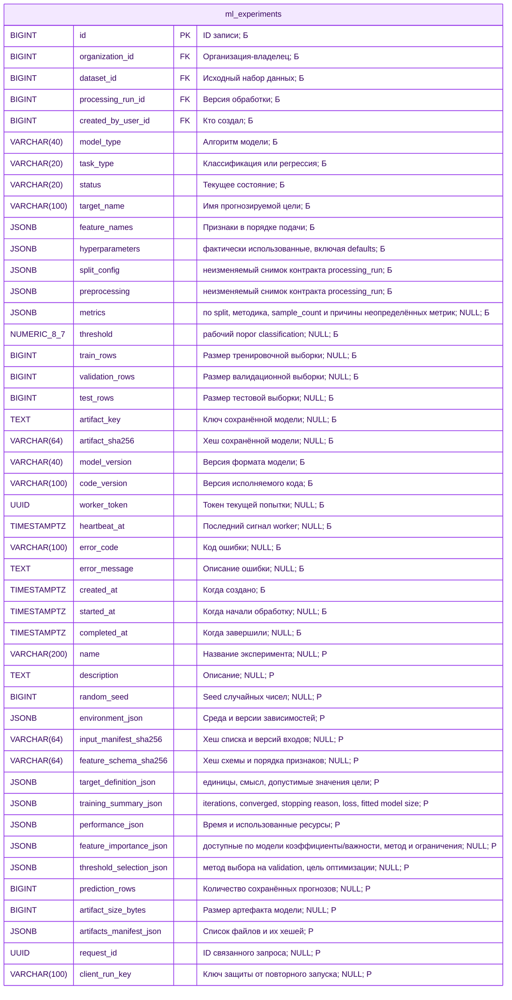
```mermaid
---
config:
  theme: base
  themeVariables:
    primaryColor: "#f3e8ff"
    primaryBorderColor: "#9333ea"
    primaryTextColor: "#3b0764"
---
erDiagram
    ml_experiments {
        BIGINT id PK "ID записи; Б"
        BIGINT organization_id FK "Организация-владелец; Б"
        BIGINT dataset_id FK "Исходный набор данных; Б"
        BIGINT processing_run_id FK "Версия обработки; Б"
        BIGINT created_by_user_id FK "Кто создал; Б"
        VARCHAR(40) model_type "Алгоритм модели; Б"
        VARCHAR(20) task_type "Классификация или регрессия; Б"
        VARCHAR(20) status "Текущее состояние; Б"
        VARCHAR(100) target_name "Имя прогнозируемой цели; Б"
        JSONB feature_names "Признаки в порядке подачи; Б"
        JSONB hyperparameters "фактически использованные, включая defaults; Б"
        JSONB split_config "неизменяемый снимок контракта processing_run; Б"
        JSONB preprocessing "неизменяемый снимок контракта processing_run; Б"
        JSONB metrics "по split, методика, sample_count и причины неопределённых метрик; NULL; Б"
        NUMERIC_8_7 threshold "рабочий порог classification; NULL; Б"
        BIGINT train_rows "Размер тренировочной выборки; NULL; Б"
        BIGINT validation_rows "Размер валидационной выборки; NULL; Б"
        BIGINT test_rows "Размер тестовой выборки; NULL; Б"
        TEXT artifact_key "Ключ сохранённой модели; NULL; Б"
        VARCHAR(64) artifact_sha256 "Хеш сохранённой модели; NULL; Б"
        VARCHAR(40) model_version "Версия формата модели; Б"
        VARCHAR(100) code_version "Версия исполняемого кода; Б"
        UUID worker_token "Токен текущей попытки; NULL; Б"
        TIMESTAMPTZ heartbeat_at "Последний сигнал worker; NULL; Б"
        VARCHAR(100) error_code "Код ошибки; NULL; Б"
        TEXT error_message "Описание ошибки; NULL; Б"
        TIMESTAMPTZ created_at "Когда создано; Б"
        TIMESTAMPTZ started_at "Когда начали обработку; NULL; Б"
        TIMESTAMPTZ completed_at "Когда завершили; NULL; Б"
        VARCHAR(200) name "Название эксперимента; NULL; Р"
        TEXT description "Описание; NULL; Р"
        BIGINT random_seed "Seed случайных чисел; NULL; Р"
        JSONB environment_json "Среда и версии зависимостей; Р"
        VARCHAR(64) input_manifest_sha256 "Хеш списка и версий входов; NULL; Р"
        VARCHAR(64) feature_schema_sha256 "Хеш схемы и порядка признаков; NULL; Р"
        JSONB target_definition_json "единицы, смысл, допустимые значения цели; Р"
        JSONB training_summary_json "iterations, converged, stopping reason, loss, fitted model size; Р"
        JSONB performance_json "Время и использованные ресурсы; Р"
        JSONB feature_importance_json "доступные по модели коэффициенты/важности, метод и ограничения; NULL; Р"
        JSONB threshold_selection_json "метод выбора на validation, цель оптимизации; NULL; Р"
        BIGINT prediction_rows "Количество сохранённых прогнозов; NULL; Р"
        BIGINT artifact_size_bytes "Размер артефакта модели; NULL; Р"
        JSONB artifacts_manifest_json "Список файлов и их хешей; Р"
        UUID request_id "ID связанного запроса; NULL; Р"
        VARCHAR(100) client_run_key "Ключ защиты от повторного запуска; NULL; Р"
    }
```

## 11. predictions — результат для конкретного обработанного входа

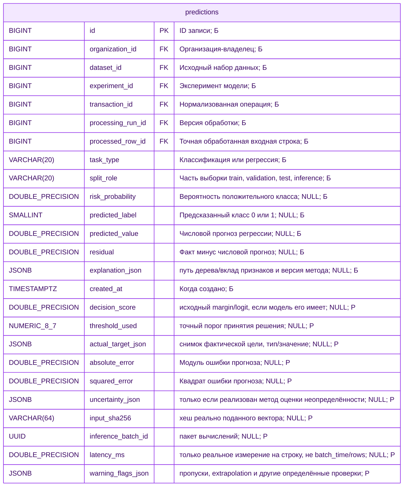
```mermaid
---
config:
  theme: base
  themeVariables:
    primaryColor: "#f3e8ff"
    primaryBorderColor: "#9333ea"
    primaryTextColor: "#3b0764"
---
erDiagram
    predictions {
        BIGINT id PK "ID записи; Б"
        BIGINT organization_id FK "Организация-владелец; Б"
        BIGINT dataset_id FK "Исходный набор данных; Б"
        BIGINT experiment_id FK "Эксперимент модели; Б"
        BIGINT transaction_id FK "Нормализованная операция; Б"
        BIGINT processing_run_id FK "Версия обработки; Б"
        BIGINT processed_row_id FK "Точная обработанная входная строка; Б"
        VARCHAR(20) task_type "Классификация или регрессия; Б"
        VARCHAR(20) split_role "Часть выборки train, validation, test, inference; Б"
        DOUBLE_PRECISION risk_probability "Вероятность положительного класса; NULL; Б"
        SMALLINT predicted_label "Предсказанный класс 0 или 1; NULL; Б"
        DOUBLE_PRECISION predicted_value "Числовой прогноз регрессии; NULL; Б"
        DOUBLE_PRECISION residual "Факт минус числовой прогноз; NULL; Б"
        JSONB explanation_json "путь дерева/вклад признаков и версия метода; NULL; Б"
        TIMESTAMPTZ created_at "Когда создано; Б"
        DOUBLE_PRECISION decision_score "исходный margin/logit, если модель его имеет; NULL; Р"
        NUMERIC_8_7 threshold_used "точный порог принятия решения; NULL; Р"
        JSONB actual_target_json "снимок фактической цели, тип/значение; NULL; Р"
        DOUBLE_PRECISION absolute_error "Модуль ошибки прогноза; NULL; Р"
        DOUBLE_PRECISION squared_error "Квадрат ошибки прогноза; NULL; Р"
        JSONB uncertainty_json "только если реализован метод оценки неопределённости; NULL; Р"
        VARCHAR(64) input_sha256 "хеш реально поданного вектора; NULL; Р"
        UUID inference_batch_id "пакет вычислений; NULL; Р"
        DOUBLE_PRECISION latency_ms "только реальное измерение на строку, не batch_time/rows; NULL; Р"
        JSONB warning_flags_json "пропуски, extrapolation и другие определённые проверки; Р"
    }
```

## 12. reports — воспроизводимая выгрузка

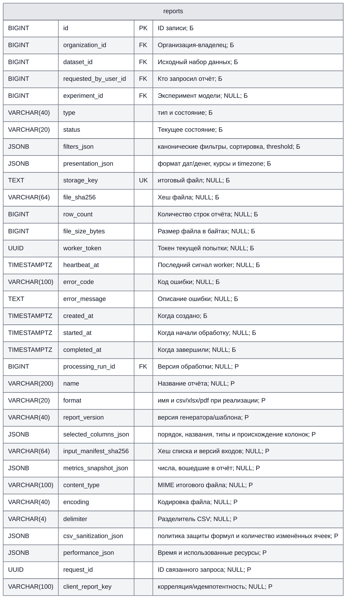
```mermaid
---
config:
  theme: base
  themeVariables:
    primaryColor: "#e5e7eb"
    primaryBorderColor: "#6b7280"
    primaryTextColor: "#111827"
---
erDiagram
    reports {
        BIGINT id PK "ID записи; Б"
        BIGINT organization_id FK "Организация-владелец; Б"
        BIGINT dataset_id FK "Исходный набор данных; Б"
        BIGINT requested_by_user_id FK "Кто запросил отчёт; Б"
        BIGINT experiment_id FK "Эксперимент модели; NULL; Б"
        VARCHAR(40) type "тип и состояние; Б"
        VARCHAR(20) status "Текущее состояние; Б"
        JSONB filters_json "канонические фильтры, сортировка, threshold; Б"
        JSONB presentation_json "формат дат/денег, курсы и timezone; Б"
        TEXT storage_key UK "итоговый файл; NULL; Б"
        VARCHAR(64) file_sha256 "Хеш файла; NULL; Б"
        BIGINT row_count "Количество строк отчёта; NULL; Б"
        BIGINT file_size_bytes "Размер файла в байтах; NULL; Б"
        UUID worker_token "Токен текущей попытки; NULL; Б"
        TIMESTAMPTZ heartbeat_at "Последний сигнал worker; NULL; Б"
        VARCHAR(100) error_code "Код ошибки; NULL; Б"
        TEXT error_message "Описание ошибки; NULL; Б"
        TIMESTAMPTZ created_at "Когда создано; Б"
        TIMESTAMPTZ started_at "Когда начали обработку; NULL; Б"
        TIMESTAMPTZ completed_at "Когда завершили; NULL; Б"
        BIGINT processing_run_id FK "Версия обработки; NULL; Р"
        VARCHAR(200) name "Название отчёта; NULL; Р"
        VARCHAR(20) format "имя и csv/xlsx/pdf при реализации; Р"
        VARCHAR(40) report_version "версия генератора/шаблона; Р"
        JSONB selected_columns_json "порядок, названия, типы и происхождение колонок; Р"
        VARCHAR(64) input_manifest_sha256 "Хеш списка и версий входов; NULL; Р"
        JSONB metrics_snapshot_json "числа, вошедшие в отчёт; NULL; Р"
        VARCHAR(100) content_type "MIME итогового файла; NULL; Р"
        VARCHAR(40) encoding "Кодировка файла; NULL; Р"
        VARCHAR(4) delimiter "Разделитель CSV; NULL; Р"
        JSONB csv_sanitization_json "политика защиты формул и количество изменённых ячеек; Р"
        JSONB performance_json "Время и использованные ресурсы; Р"
        UUID request_id "ID связанного запроса; NULL; Р"
        VARCHAR(100) client_report_key "корреляция/идемпотентность; NULL; Р"
    }
```

## 13. audit_events — неизменяемая история действий

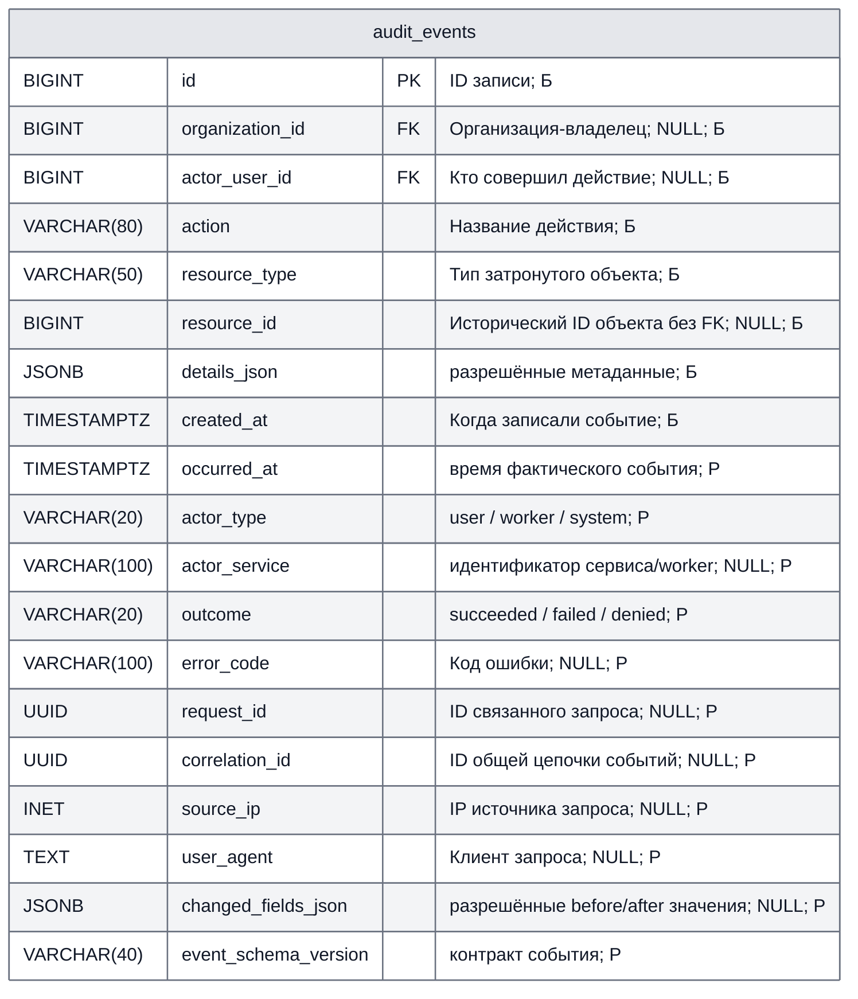
```mermaid
---
config:
  theme: base
  themeVariables:
    primaryColor: "#e5e7eb"
    primaryBorderColor: "#6b7280"
    primaryTextColor: "#111827"
---
erDiagram
    audit_events {
        BIGINT id PK "ID записи; Б"
        BIGINT organization_id FK "Организация-владелец; NULL; Б"
        BIGINT actor_user_id FK "Кто совершил действие; NULL; Б"
        VARCHAR(80) action "Название действия; Б"
        VARCHAR(50) resource_type "Тип затронутого объекта; Б"
        BIGINT resource_id "Исторический ID объекта без FK; NULL; Б"
        JSONB details_json "разрешённые метаданные; Б"
        TIMESTAMPTZ created_at "Когда записали событие; Б"
        TIMESTAMPTZ occurred_at "время фактического события; Р"
        VARCHAR(20) actor_type "user / worker / system; Р"
        VARCHAR(100) actor_service "идентификатор сервиса/worker; NULL; Р"
        VARCHAR(20) outcome "succeeded / failed / denied; Р"
        VARCHAR(100) error_code "Код ошибки; NULL; Р"
        UUID request_id "ID связанного запроса; NULL; Р"
        UUID correlation_id "ID общей цепочки событий; NULL; Р"
        INET source_ip "IP источника запроса; NULL; Р"
        TEXT user_agent "Клиент запроса; NULL; Р"
        JSONB changed_fields_json "разрешённые before/after значения; NULL; Р"
        VARCHAR(40) event_schema_version "контракт события; Р"
    }
```

## 14. exchange_rates — курс и происхождение ответа

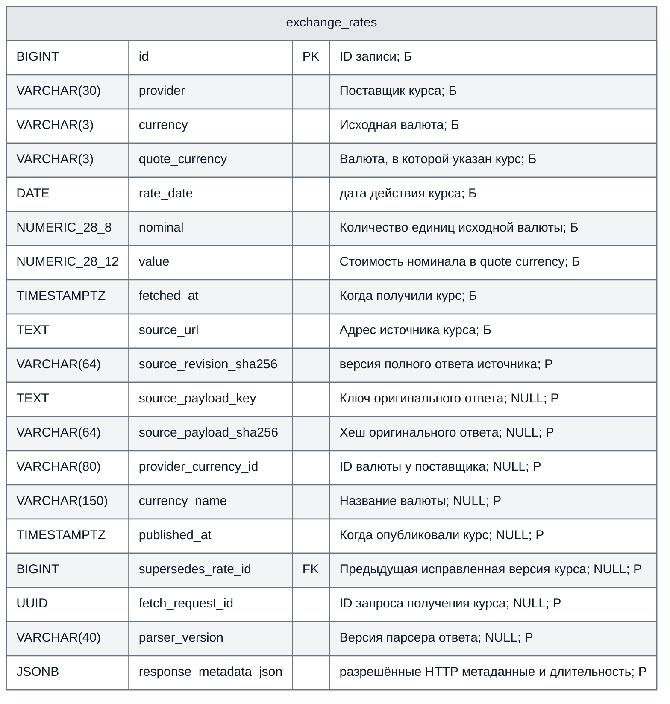
```mermaid
---
config:
  theme: base
  themeVariables:
    primaryColor: "#e5e7eb"
    primaryBorderColor: "#6b7280"
    primaryTextColor: "#111827"
---
erDiagram
    exchange_rates {
        BIGINT id PK "ID записи; Б"
        VARCHAR(30) provider "Поставщик курса; Б"
        VARCHAR(3) currency "Исходная валюта; Б"
        VARCHAR(3) quote_currency "Валюта, в которой указан курс; Б"
        DATE rate_date "дата действия курса; Б"
        NUMERIC_28_8 nominal "Количество единиц исходной валюты; Б"
        NUMERIC_28_12 value "Стоимость номинала в quote currency; Б"
        TIMESTAMPTZ fetched_at "Когда получили курс; Б"
        TEXT source_url "Адрес источника курса; Б"
        VARCHAR(64) source_revision_sha256 "версия полного ответа источника; Р"
        TEXT source_payload_key "Ключ оригинального ответа; NULL; Р"
        VARCHAR(64) source_payload_sha256 "Хеш оригинального ответа; NULL; Р"
        VARCHAR(80) provider_currency_id "ID валюты у поставщика; NULL; Р"
        VARCHAR(150) currency_name "Название валюты; NULL; Р"
        TIMESTAMPTZ published_at "Когда опубликовали курс; NULL; Р"
        BIGINT supersedes_rate_id FK "Предыдущая исправленная версия курса; NULL; Р"
        UUID fetch_request_id "ID запроса получения курса; NULL; Р"
        VARCHAR(40) parser_version "Версия парсера ответа; NULL; Р"
        JSONB response_metadata_json "разрешённые HTTP метаданные и длительность; Р"
    }
```

## 15. auth_sessions — сессия входа

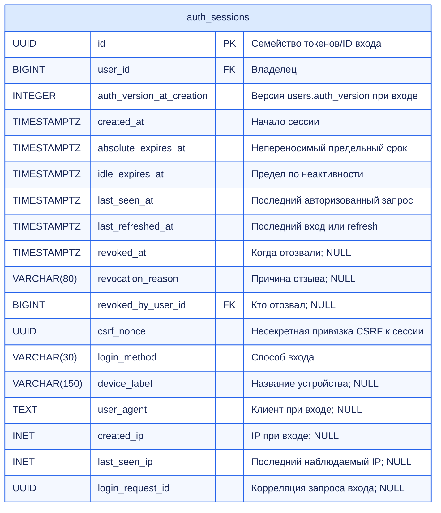
```mermaid
---
config:
  theme: base
  themeVariables:
    primaryColor: "#dbeafe"
    primaryBorderColor: "#2563eb"
    primaryTextColor: "#172554"
---
erDiagram
    auth_sessions {
        UUID id PK "Семейство токенов/ID входа"
        BIGINT user_id FK "Владелец"
        INTEGER auth_version_at_creation "Версия users.auth_version при входе"
        TIMESTAMPTZ created_at "Начало сессии"
        TIMESTAMPTZ absolute_expires_at "Непереносимый предельный срок"
        TIMESTAMPTZ idle_expires_at "Предел по неактивности"
        TIMESTAMPTZ last_seen_at "Последний авторизованный запрос"
        TIMESTAMPTZ last_refreshed_at "Последний вход или refresh"
        TIMESTAMPTZ revoked_at "Когда отозвали; NULL"
        VARCHAR(80) revocation_reason "Причина отзыва; NULL"
        BIGINT revoked_by_user_id FK "Кто отозвал; NULL"
        UUID csrf_nonce "Несекретная привязка CSRF к сессии"
        VARCHAR(30) login_method "Способ входа"
        VARCHAR(150) device_label "Название устройства; NULL"
        TEXT user_agent "Клиент при входе; NULL"
        INET created_ip "IP при входе; NULL"
        INET last_seen_ip "Последний наблюдаемый IP; NULL"
        UUID login_request_id "Корреляция запроса входа; NULL"
    }
```

## 16. auth_refresh_tokens — неизменяемые поколения refresh

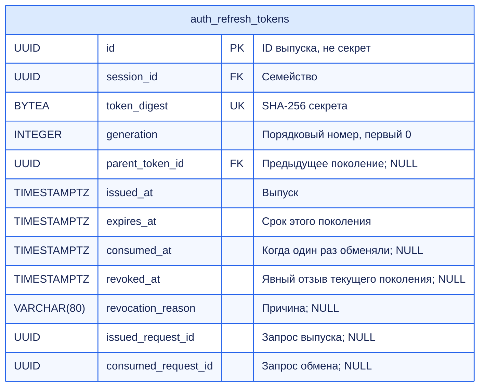
```mermaid
---
config:
  theme: base
  themeVariables:
    primaryColor: "#dbeafe"
    primaryBorderColor: "#2563eb"
    primaryTextColor: "#172554"
---
erDiagram
    auth_refresh_tokens {
        UUID id PK "ID выпуска, не секрет"
        UUID session_id FK "Семейство"
        BYTEA token_digest UK "SHA-256 секрета"
        INTEGER generation "Порядковый номер, первый 0"
        UUID parent_token_id FK "Предыдущее поколение; NULL"
        TIMESTAMPTZ issued_at "Выпуск"
        TIMESTAMPTZ expires_at "Срок этого поколения"
        TIMESTAMPTZ consumed_at "Когда один раз обменяли; NULL"
        TIMESTAMPTZ revoked_at "Явный отзыв текущего поколения; NULL"
        VARCHAR(80) revocation_reason "Причина; NULL"
        UUID issued_request_id "Запрос выпуска; NULL"
        UUID consumed_request_id "Запрос обмена; NULL"
    }
```
