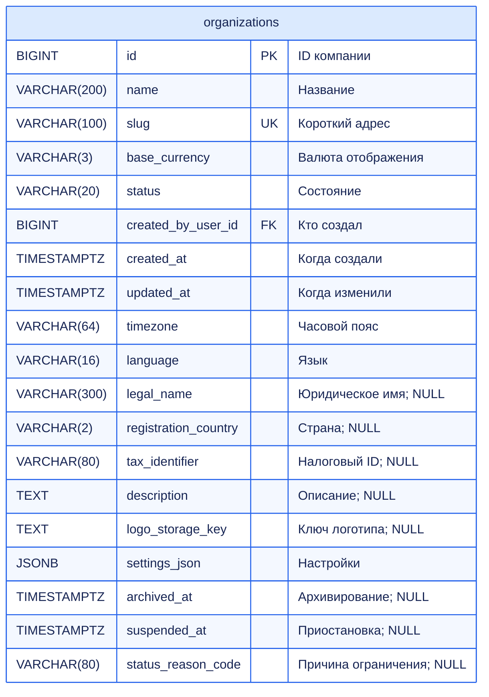
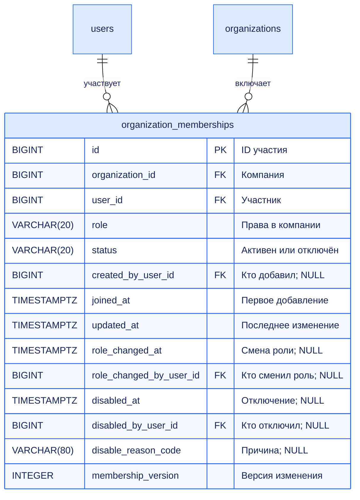
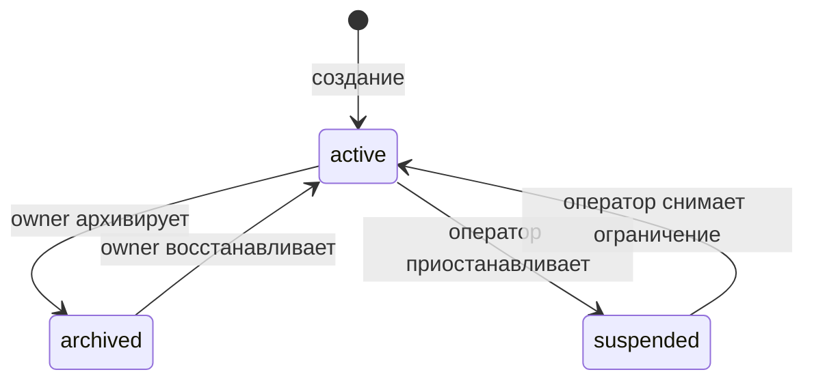

# FinSight: организации — полный контракт первого этапа

Дата: 03.10.2026. Статус: проектирование, без изменения Backend и миграций.
Связанные документы: DATABASE_ARCHITECTURE.md, DATABASE_DATA_DICTIONARY.md, AUTH_ARCHITECTURE.md.

Профиль пользователя и единый lifecycle: [USERS_ARCHITECTURE.md](USERS_ARCHITECTURE.md). Роли компании не дают права редактировать чужой аккаунт, а закрытие User сохраняет корпоративные данные и требует передачи единоличного владения.

## 1. Что такое организация

Organization — отдельное рабочее пространство компании: собственные наборы данных, обработка, модели, прогнозы, отчёты и участники. Это не отдельная база: все компании находятся в одной PostgreSQL, разделяются organization_id и проверками доступа.

User — аккаунт человека. Membership — его участие и роль в конкретной компании. Один user может работать в нескольких компаниях. Переключение компании выбирает контекст интерфейса и запросов, но не выдаёт права автоматически и не требует нового JWT.

Создатель организации становится первым owner. created_by_user_id — историческое авторство, а не текущий владелец. Текущие владельцы определяются активными memberships пользователей со status=active. Несколько owners допустимы.

Предметная часть первого этапа — organizations и organization_memberships. Не заводим accounts/branches/billing/invitations без их сценариев. Вместе с текущими users это три основные таблицы блока. auth и audit являются общей инфраструктурой: audit_events вводится до операций, которым обещан атомарный журнал, а не после них. Общая целевая архитектура с аналитикой и авторизацией остаётся 16 таблиц.

## 2. organizations — все поля

Обязательные поля без ?. Р — расширение; если столбец реализован, его NULL/default соответствует таблице. created/updated — TIMESTAMPTZ; Python datetime с timezone.

| Колонка | Тип | Назначение / правило |
|---|---|---|
| id | BIGINT PK identity | Внутренний ID компании |
| name | VARCHAR(200) NOT NULL | Отображаемое название, 1–200 после trim |
| slug | VARCHAR(100) NOT NULL UNIQUE | Короткий адрес, lowercase ASCII |
| base_currency | VARCHAR(3) NOT NULL DEFAULT RUB | Валюта представления аналитики |
| status | VARCHAR(20) NOT NULL DEFAULT active | active / suspended / archived |
| created_by_user_id | BIGINT FK users.id NOT NULL | Создатель; не источник owner-права |
| created_at | TIMESTAMPTZ NOT NULL DEFAULT now() | Создание |
| updated_at | TIMESTAMPTZ NOT NULL DEFAULT now() | Последнее изменение; обновляется сервисом |
| timezone | VARCHAR(64) NOT NULL DEFAULT Europe/Moscow | Р: default timezone отображения |
| language | VARCHAR(16) NOT NULL DEFAULT ru | Р: язык по умолчанию |
| legal_name? | VARCHAR(300) | Р: юридическое название |
| registration_country? | VARCHAR(2) | Р: страна регистрации |
| tax_identifier? | VARCHAR(80) | Р: налоговый ID из введённых данных |
| description? | TEXT | Р: описание; API ограничивает длину до 2000 |
| logo_storage_key? | TEXT | Р: ключ проверенного управляемого файла |
| settings_json | JSONB object NOT NULL DEFAULT {} | Р: версионированные разрешённые настройки |
| archived_at? | TIMESTAMPTZ | Когда архивировали; при восстановлении NULL, история в audit |
| suspended_at? | TIMESTAMPTZ | Когда приостановили |
| status_reason_code? | VARCHAR(80) | Причина текущего ограничения |

Минимальная первая миграция может включать все перечисленные поля с defaults/NULL, без реализации всех экранов юридического профиля и логотипа. Не принимать произвольные неизвестные поля settings_json через API.

### Ограничения и смысл настроек

- CHECK status; CHECK char_length(btrim(name)) BETWEEN 1 AND 200; CHECK slug соответствует `^[a-z0-9][a-z0-9-]{1,98}[a-z0-9]$` (3–100 символов); UNIQUE(slug). Для первого этапа slug неизменяем после создания.
- CHECK base_currency соответствует `[A-Z]{3}`; список реально поддержанных валют проверяет сервис. Три буквы сами по себе не доказывают существование валюты.
- CHECK jsonb_typeof(settings_json)='object'. Допустимые настройки валидирует Pydantic, неизвестные запрещены.
- active: archived_at/suspended_at/reason NULL; archived: archived_at задан, suspended_at NULL; suspended: suspended_at задан, archived_at NULL. Для ограниченных состояний reason обязателен. Сервис выполняет переход и audit вместе.
- Юридические реквизиты необязательны, не определяют права и не имеют глобального UNIQUE без отдельного договора о филиалах/странах.
- base_currency/timezone меняют представление следующих запросов, но не исходные amount/currency/time. Импорт, обработка и отчёт сохраняют фактически использованные настройки в своём снимке.
- В settings_json допустимы schema_version и предусмотренные import/display настройки. Организация может снижать общий серверный лимит файла/параллелизма, но не повышать его самостоятельно. Доступ/роли и секреты не прячутся в JSON.

Индексы: UNIQUE(slug); (created_by_user_id) для FK; списки компаний пользователя получают через memberships. Отдельный index(status) заранее не нужен. Обновление профиля блокирует organization FOR UPDATE; optimistic If-Match/organization_version можно добавить при появлении конкурентного редактирования, это отдельное расширение, не уже существующее поле.

## 3. organization_memberships — все поля

| Колонка | Тип | Назначение / правило |
|---|---|---|
| id | BIGINT PK identity | ID участия |
| organization_id | BIGINT FK organizations.id NOT NULL | Компания |
| user_id | BIGINT FK users.id NOT NULL | Участник |
| role | VARCHAR(20) NOT NULL | owner / analyst / viewer |
| status | VARCHAR(20) NOT NULL DEFAULT active | active / disabled |
| created_by_user_id? | BIGINT FK users.id | Кто впервые добавил |
| joined_at | TIMESTAMPTZ NOT NULL DEFAULT now() | Первое добавление, не перезаписывается при восстановлении |
| updated_at | TIMESTAMPTZ NOT NULL DEFAULT now() | Последнее изменение |
| role_changed_at? | TIMESTAMPTZ | Когда поменяли роль |
| role_changed_by_user_id? | BIGINT FK users.id | Кто поменял роль |
| disabled_at? | TIMESTAMPTZ | Когда отключили |
| disabled_by_user_id? | BIGINT FK users.id | Кто отключил; NULL для самостоятельного выхода/системы согласно событию |
| disable_reason_code? | VARCHAR(80) | Почему отключили |
| membership_version | INTEGER NOT NULL DEFAULT 0 | Версия конкурентного изменения |

UNIQUE(organization_id,user_id); CHECK role/status; membership_version >= 0. При active disabled_at/reason NULL; при disabled они заданы. История прежних отключений сохраняется в audit. FK по умолчанию RESTRICT: физическое удаление User/Organization не уничтожает участие молча.

UNIQUE уже обслуживает список по organization_id. Дополнительный индекс (user_id,status,organization_id) — компании человека; (organization_id,role,status) — владельцы, если реальный запрос этого требует. Активное участие не означает активный аккаунт: user.status проверяется отдельно.

## 4. Права в активной организации

| Действие | owner | analyst | viewer |
|---|---|---|---|
| Смотреть разрешённые сводки/операции/ML-результаты | Да | Да | Да |
| Смотреть минимальный список участников (имя, роль) | Да | Да | Да |
| Читать/скачивать исходный CSV и сырые записи | Да | Да | Нет |
| Загружать/повторять импорт, архивировать dataset | Да | Да | Нет |
| Запускать обработку/ML | Да | Да | Нет |
| Создавать/скачивать отчёт | Да | Да | Нет |
| Менять профиль и настройки компании | Да | Нет | Нет |
| Добавлять/отключать участников и менять роли | Да | Нет | Нет |
| Назначать владельца/передавать свою роль | Да, с повторной проверкой пароля | Нет | Нет |
| Архивировать/восстанавливать организацию | Да | Нет | Нет |
| Выйти из организации | Да, если остаётся owner | Да | Да |

Email/телефон участников не входят в минимальный список для analyst/viewer. Owner получает только контакты, необходимые управлению участием; никаких password/auth session данных. Клиент может скрыть кнопку, но Backend всегда повторяет проверку.

Права на raw/files заданы явно: «viewer смотрит данные» не означает неограниченную выгрузку оригинала. В будущем при пользовательских ролях нужен отдельный permissions контракт; сейчас трёх фиксированных ролей достаточно.

## 5. Состояния организации

- **active:** действуют права из матрицы.
- **archived:** активные участники читают прежние результаты по своим ролям; новые импорты/обработка/ML/отчёты и изменение участников запрещены. Скачивание уже готовых файлов допускается owner/analyst. Owner может восстановить компанию. Самостоятельный выход допускается с защитой последнего owner.
- **suspended:** финансовые данные/файлы и фоновые публикации недоступны всем ролям; owner видит минимальную карточку состояния и причину, другие участники — минимальный статус без чувствительных подробностей. Изменения/выход запрещены до снятия ограничения оператором.

Оператор платформы — управляемая серверная команда на первом этапе. В users сейчас нет реализованной системной роли: обычный owner не получает право suspended/unsuspend. Если появится административный HTTP API, его системные полномочия проектируются отдельно.

Для проверки состояния нужен action-aware permission service: старое общее правило «только status=active для любого чтения» уточняется, чтобы archived не делал сохранённые данные недоступными. Доступ финансовых данных suspended закрыт независимо от роли.

Архивирование/приостановка запрещены, пока есть validating/importing datasets или pending/running processing/experiments/reports. На первом этапе возвращаем 409 organization_busy; не изображаем отмену задач без механизма cancellation. Запуск новой задачи и переход состояния сериализуются блокировкой organization, чтобы гонка не оставляла running задачу в только что архивированной компании. При принудительном административном сценарии потребуются fencing/cancellation и повторная проверка перед публикацией.

## 6. Основные операции и транзакции

### Создание компании

Авторизованный активный User отправляет name, slug?, base_currency?, timezone?, language?. Role/status/created_by из запроса не принимаются. Сервер выбирает создателя из auth context, создаёт Organization(active), его Membership(owner,active) и audit event в одной транзакции.

Если slug не передан, сервер генерирует `org-<случайный суффикс>`; name остаётся любым поддерживаемым текстом. Предварительная проверка UNIQUE не заменяет обработку конфликта БД. При явно занятом slug — 409; при случайной коллизии сервер ограниченно повторяет генерацию. Две компании с одинаковым name допустимы.

Повтор отправки не создаёт новую компанию автоматически: UI блокирует двойной submit, а сетевой повтор записи без идемпотентности требует проверки списка. Для автоматического retry позже вводится общий durable request-idempotency storage; один client request_id в audit не делает операцию идемпотентной.

При объединённой регистрации владельца User + Organization + Membership создаются одним service unit-of-work. Existing user может создать следующую компанию через POST /organizations. Создание компании не требует чужого разрешения и не передаёт доступ к существующим компаниям.

### Добавление участника для MVP

Owner добавляет существующего активного пользователя по точному user_id, назначает analyst/viewer. Нужен доверенный способ получить ID: учебные аккаунты/управляемое создание или пользователь сам сообщает свой ID из профиля. Не строим глобальный каталог пользователей ради формы.

Одна пара user/org существует один раз. Уже active → 409 member_already_active. Disabled → отдельная операция restore с явно подтверждённой ролью, joined_at/создатель не меняются; audit фиксирует восстановление. Заблокированный user не активируется. Owner-role не назначается этим обычным endpoint; для повышения есть отдельный чувствительный сценарий.

Прямое добавление допустимо для управляемого MVP. Для публичного продукта добавление требует согласия приглашённого; тогда реализуются приглашения из раздела 9 вместо молчаливого зачисления.

### Роли, owner и самостоятельный выход

Обычная смена analyst/viewer проверяет expected membership_version, увеличивает её, обновляет role_changed_* и audit. Несовпадение версии → 409 stale_membership. Все другие изменения membership тоже увеличивают version.

Назначение нового owner требует текущего пароля инициатора, существующего active участника и user.status=active. Передача своей роли: целевой участник становится owner, инициатор становится analyst, другие владельцы остаются; всё в одной транзакции. Выбираем явный endpoint, а не серию двух независимых PATCH.

Owner может понизить/отключить себя или другого owner только если после операции остаётся хотя бы один активный владелец с active user. Последний owner сначала передаёт роль, остаётся участником или архивирует организацию; архивирование само по себе не разрешает лишить её всех owners. Creator не обязан оставаться owner навсегда.

Самостоятельный выход устанавливает membership.disabled/reason=left, сохраняет историю. Он не удаляет загруженные пользователем datasets, модели и отчёты: данные принадлежат компании. Участник, добавленный повторно, использует ту же связь.

### Блокировки и последние владельцы

Для связанных изменений общий порядок: users по ID → organizations по ID → memberships по ID → auth_sessions по UUID при необходимости. Сервис повторно проверяет role/status после получения блокировок. Все операции уменьшения числа владельцев блокируют organization FOR UPDATE перед подсчётом. Это включает передачу роли, выход, отключение участника и блокировку/обезличивание User.

Membership_version защищает от потери параллельных изменений одной записи; organization lock защищает межстрочное правило последнего owner. Без единого протокола два владельца могут одновременно отключить друг друга.

User-блокировка сначала проверяет все его компании. Если он последний owner в активной/архивированной организации, обычная операция блокировки отказывает и требует назначить другого владельца. Принудительный административный инцидентный сценарий должен отдельно определить приостановку и восстановление компании; не оставлять его скрытым исключением.

## 7. Tenant scope и ограничения API

Пути содержат /organizations/{organization_id}; сервер сопоставляет текущего user с membership. Нельзя получить права из organization_id в JWT, заголовке или сохранённом localStorage. Эти значения выбирают компанию, но не авторизуют запрос.

Запрос dataset по ID выполняется с organization_id, и дочерние записи защищены составными FK. Пользователь без active membership получает 404 для чужой компании/ресурса, чтобы ID не раскрывал существование. Участник с недостаточной ролью получает 403. Состояние archived/suspended для своей компании — отдельный понятный код.

Смена membership не требует logout всех auth_sessions: следующая проверка прав компании видит новые значения. Аутентификация остаётся пользовательской, не организационной. Для фоновой задачи перед исполнением проверяются организация и полномочия инициатора; перед публикацией повторяется action-aware проверка. Если инициатор отключён, задача не выдаёт ему результат автоматически; владельцы управляют дальнейшим действием по явному протоколу.

В схемах Create/Update используется allowlist; запрещены extra поля. Клиент не пишет id, created_by, role первого owner, status компании, timestamps, версии и audit JSON произвольно.

## 8. HTTP-контракты первого этапа

Все маршруты /api/v1, авторизация Bearer из AUTH_ARCHITECTURE.md.

| Метод и путь | Кто | Вход / результат |
|---|---|---|
| GET /organizations | Активный User | Только свои active memberships; фильтр состояния, cursor, limit ≤100 |
| POST /organizations | Активный User | Create; 201 Organization + current_membership |
| GET /organizations/{id} | Участник | Карточка по правилам состояния |
| PATCH /organizations/{id} | Owner, active | Allowlist профиль/настройки; 200 |
| POST /organizations/{id}/archive | Owner, active | 200 archived или 409 busy |
| POST /organizations/{id}/restore | Owner, archived | 200 active |
| GET /organizations/{id}/members | Участник, active/archived | Минимальный список, у owner расширенный; limit ≤100 |
| POST /organizations/{id}/members | Owner, active | user_id, role=analyst/viewer; 201 |
| PATCH /organizations/{id}/members/{membership_id}/role | Owner, active | role, expected_version; 200 |
| POST /organizations/{id}/members/{membership_id}/disable | Owner, active | expected_version, reason_code; 200 |
| POST /organizations/{id}/members/{membership_id}/restore | Owner, active | role=analyst/viewer, expected_version; 200 |
| POST /organizations/{id}/members/{membership_id}/promote-owner | Owner, active | current_password, expected_version; 200 |
| POST /organizations/{id}/transfer-ownership | Owner, active | target_membership_id, ожидаемые версии обеих memberships, current_password; 200 |
| POST /organizations/{id}/leave | Участник, active/archived | expected_version; 204 или 409 last_owner |

В первом этапе generic role PATCH меняет только analyst↔viewer. Назначение owner — promote-owner; owner понижает себя через transfer и становится analyst. Отключение другого owner — отдельный disable с повторной проверкой пароля и инварианта. Произвольный downgrade owner через generic PATCH запрещён.

Owner-disable другого owner требует повторной проверки пароля; поле current_password принимается только в чувствительной схеме. В обычных read/update DTO пароль отсутствует. Сервис не пишет его в журнал.

OrganizationCreate: name, slug?, base_currency=RUB, timezone=Europe/Moscow, language=ru.
OrganizationUpdate: name?, base_currency?, timezone?, language?, legal_name?, registration_country?, tax_identifier?, description?, разрешённые settings?. Не использовать `exclude_none` там, где NULL означает очистить optional поле: отличать отсутствующее поле от явного null.
OrganizationRead: все разрешённые поля профиля, timestamps, my_role, permitted_actions (подсказка UI, не источник прав).
MemberRead: id, user_id, display_name, role, status, joined_at, membership_version; owner-only контакты/операционные поля по отдельному response contract.

Ошибки: 401 authentication_required; 403 permission_denied; 404 organization_not_found/member_not_found; 409 slug_taken/member_already_active/last_owner/organization_busy/stale_membership; 422 invalid_input. Slug/name/role не принимаются без валидации. Создание организаций и операции участников имеют серверный rate limit; реальные глобальные quota вводятся с функцией, не полем plan без поведения.

## 9. Приглашения — следующий этап, не обязательны для первого запуска

Публичный Owner вводит email и role=analyst/viewer. Система создаёт одноразовое приглашение, новый/существующий пользователь входит, подтверждает email и явно принимает. Ссылка не создаёт owner и не меняет роль уже активного участника.

Таблица organization_invitations вводится отдельной миграцией, увеличивая текущие 16 таблиц до 17 только при реализации приглашений:

| Поле | Тип | Назначение |
|---|---|---|
| id | UUID PK | ID приглашения |
| organization_id | BIGINT FK | Компания |
| email | VARCHAR(255) | Нормализованный адрес получателя |
| role | VARCHAR(20) CHECK analyst/viewer | Предлагаемая роль |
| token_digest | BYTEA UNIQUE, 32 bytes | Хеш случайного секрета |
| invited_by_user_id | BIGINT FK | Кто пригласил |
| created_at, expires_at | TIMESTAMPTZ | Выпуск/срок; предлагаем 72 часа |
| accepted_at?, accepted_by_user_id? | TIMESTAMPTZ / BIGINT FK | Когда и кем принято |
| revoked_at?, revoked_by_user_id? | TIMESTAMPTZ / BIGINT FK | Отзыв |
| revocation_reason? | VARCHAR(80) | Причина отзыва |

CHECK принятие и отзыв взаимоисключаются. Срок проверяется сервисом. Частичный UNIQUE(organization_id,email) WHERE accepted_at IS NULL AND revoked_at IS NULL не исключает уже expired строки: перевыпуск сначала отзывает прежнее приглашение под organization lock, затем вставляет новое. Повторное принятие возвращает существующий результат без повторного назначения роли.

При acceptance проверить digest, сроки, active organization, действующего owner-инициатора, совпадение подтверждённого email аккаунта, отсутствие действующего участника. Owner утратил права — приглашение недействительно; проверка и membership insert/restore + accept + audit в одной транзакции. Если user имеет disabled membership, owner должен разрешить его восстановление явно; одно старое приглашение не обходится вокруг отключения.

Frontend получает секрет приглашения из fragment ссылки, убирает из адреса и передаёт POST body, не query в логи. На странице принятия нет сторонних ресурсов/аналитики до удаления секрета; response no-store. Password/hash/session данные в приглашении отсутствуют. Для доставки потребуется настроенный отправитель; в этой задаче никакие письма не отправляются.

## 10. Audit, хранение и интерфейс

События: organization.created/profile_updated/settings_updated/archived/restored/suspended/unsuspended; membership.added/role_changed/disabled/restored/left; ownership.promoted/transferred; invitation.created/accepted/revoked на следующем этапе.

Для важных изменений предметные записи и audit event коммитятся вместе. details хранят IDs, before/after role/status/settings allowlist и причину; не пароли, токены, финансовый CSV или полный список контактов. organization_id у события совпадает с изменяемой компанией, actor определяется сервером.

В интерфейсе: список своих компаний → создание → переключатель текущей компании → карточка/настройки → участники → действия owner. При потере доступа очищается выбранная компания и её клиентский кэш; затем выбирается другая доступная. Ключи клиентского кэша включают organization_id, чтобы одинаковые пути не показывали данные прежней компании после переключения.

Для archived показывается баннер и read-only режим. Для suspended — минимальная карточка без финансовых данных. Owner-действия имеют подтверждение последствий, а promote/transfer/disable-owner — поле текущего пароля. Last-owner ошибка объясняет, кому сначала передать управление.

Физическое удаление организаций в обычном API отсутствует. Архивирование сохраняет файлы, raw/processed данные, модели, отчёты и membership историю. Пользовательские auth_sessions не удаляются при архивировании одной компании: пользователь может работать в других.

## 11. Модули и порядок самостоятельной реализации

organizations/models.py — Organization/Membership; schemas.py — DTO; repository.py — scoped queries и locks без commit; service.py — транзакции/инварианты; permissions.py — action/role/state matrix; router.py — HTTP. Audit подключается общей службой. Пароль проверяется auth-модулем, не отдельным слабым кодом для owner.

1. Исправить исходные migrations/users и обеспечить настоящую аутентификацию.
2. Создать Organization/Membership ORM + migration; проверить BIGINT FK и defaults.
3. Сделать create/list/get и атомарное назначение первого owner.
4. Подключить org scope к данным и проверку role/state.
5. Сделать add/list/disable/restore/role/leave, защиту последнего owner и версий.
6. Сделать promote/transfer, owner password reauthentication.
7. Сделать настройки/archive/restore, запрет при running задачах и audit.
8. Реализовать страницы/переключение/кэш, затем приглашения при необходимости.

## 12. Проверки

| Сценарий | Ожидание |
|---|---|
| Создание компании | Organization и owner membership вместе; rollback не оставляет компанию без owner |
| User в двух компаниях | Разные роли, независимые данные |
| Подмена org/resource/member ID | Нет доступа/изменений чужой компании |
| Viewer пробует импорт/сырой файл/роль | 403 |
| Analyst меняет настройки/участников | 403 |
| Уже существующее membership | Нет дубля, restore отдельный |
| Два owner одновременно уходят/отключают | Хотя бы один active owner остаётся |
| Блокировка последнего owner | Отказ до нарушения инварианта |
| Передача роли падает посередине | Обе роли и audit откатываются |
| stale membership_version | 409, прежнее изменение не потеряно |
| Archive конкурирует с запуском задания | Либо запуск разрешён и archive=409, либо archive завершён и запуск запрещён |
| archived | Чтение доступно по роли, новые задания запрещены |
| suspended | Нет финансовых данных/файлов |
| Смена валюты/timezone | Оригинальные данные и старые отчёты не переписываются |
| Переключение компании | Нет данных предыдущей компании из кэша |
| Приглашение другого email/expired/revoked | Не создаёт membership |

Межстрочные правила и конкуренция проверяются интеграционно на PostgreSQL. Сейчас создан документ; реализация и тесты этого модуля не выполнялись.
