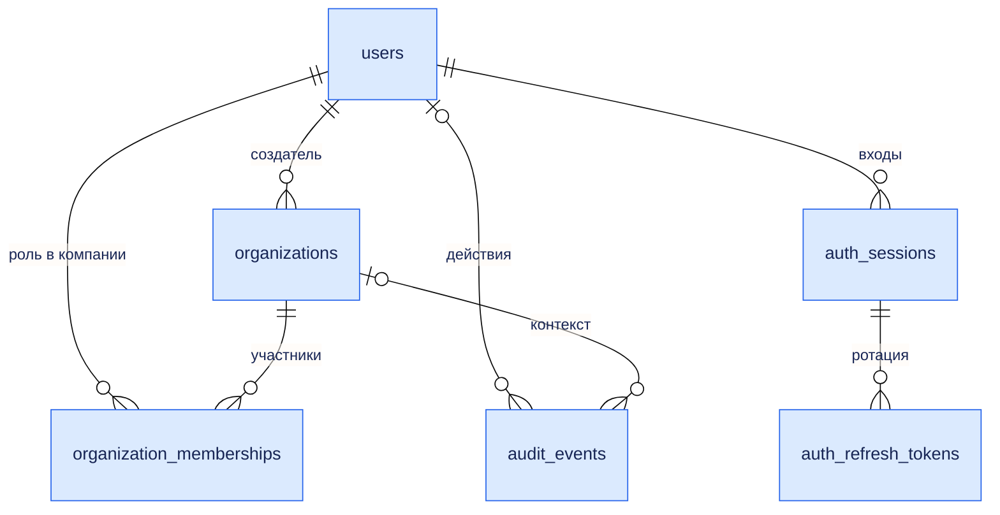
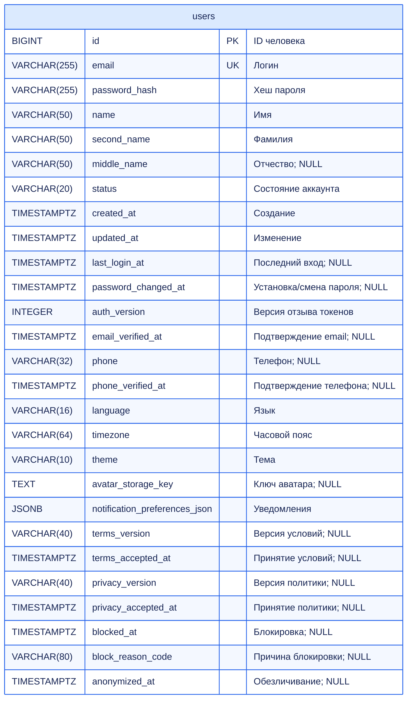
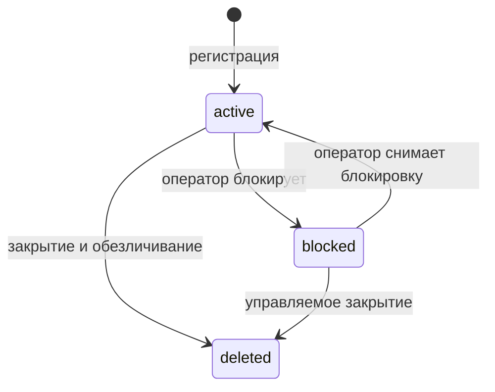

# FinSight: users вместе с организациями и авторизацией

Дата: 03.10.2026. Статус: согласуемый проектный контракт; Backend/миграции не изменены.
Дополняет ORGANIZATIONS_ARCHITECTURE.md, AUTH_ARCHITECTURE.md и DATABASE_DATA_DICTIONARY.md.

## 1. Разделение ответственности

- users — человек, его логин, профиль, настройки и состояние аккаунта.
- organizations — компания и её рабочее пространство.
- organization_memberships — участие человека в компании и роль именно там.
- auth_sessions — отдельные входы человека, независимые от выбранной компании.
- auth_refresh_tokens — поколения одноразовых refresh-токенов сессии.
- audit_events — значимые действия человека/системы, включая изменения профиля, участия и доступа.

Не добавляем users.organization_id/role при модели многих компаний. Не храним токены внутри users. created_by_user_id компании — историческая ссылка, не постоянное право owner. Удаление/блокировка человека не уничтожает созданные им корпоративные данные.

## 2. Что требует внимания в текущем коде

| Место | Наблюдение | Планируемое изменение |
|---|---|---|
| users/models.py: id | Python int и Identity; SQLAlchemy выводит INTEGER | Явный BIGINT в согласованной миграции вместе с будущими FK |
| users/models.py: middle_name | Mapped[str] без явного nullable | Mapped[str \| None], nullable=True, как в request schema |
| users/models.py: timestamps | Mapped[str] при DateTime | Mapped[datetime] / Mapped[datetime \| None], timezone=True |
| users/models.py: email | unique=True + index=True | Одна уникальность/индекс с проверкой итоговой миграции; не создавать дублирующий UNIQUE индекс |
| users/schemas.py | Email max_length=100, в ORM 255 | Один договор max_length=255 |
| users/schemas.py: name/second_name | Только max_length | Обязательные непустые значения после trim |
| users/service.py | password_hash=1234567890 | Настоящий Argon2id hash, никогда не константа |
| users/repository.py | save_user выполняет commit | add/flush в repository; commit принадлежит service unit-of-work |
| users/router.py | GET /users/{id} без auth | Собственный /users/me; чужие люди видны только через разрешённый org-scoped список |
| users/router.py | POST /users создаёт только User | Целевой public сценарий — /auth/register с атомарным User+Organization+Membership |

Это описание просмотренной заготовки. Исправления и проверки runtime пока не выполнялись. Историю применённых миграций нельзя переписывать без проверки состояния БД.

## 3. users — все 27 колонок

NN — NOT NULL, ? — nullable. Б — базовый контракт; Р — расширение соответствующей функции. auth_version включается в базовый контракт, когда вводим описанную авторизацию.

| Колонка | Тип / default | Для чего |
|---|---|---|
| id | BIGINT PK identity | ID человека |
| email | VARCHAR(255) NN UNIQUE | Нормализованный логин |
| password_hash | VARCHAR(255) NN | Хеш пароля |
| name | VARCHAR(50) NN | Имя |
| second_name | VARCHAR(50) NN | Фамилия |
| middle_name? | VARCHAR(50) | Отчество |
| status | VARCHAR(20) NN DEFAULT active | active / blocked / deleted |
| created_at | TIMESTAMPTZ NN DEFAULT now() | Создание аккаунта |
| updated_at | TIMESTAMPTZ NN DEFAULT now() | Последнее изменение; сервис обновляет явно |
| last_login_at? | TIMESTAMPTZ | Последний успешный вход |
| password_changed_at? | TIMESTAMPTZ | Последняя установка/смена пароля |
| auth_version | INTEGER NN DEFAULT 0 | Глобальный отзыв токенов пользователя |
| email_verified_at? | TIMESTAMPTZ | Р: подтверждённый email |
| phone? | VARCHAR(32) | Р: телефон, если реализован сценарий |
| phone_verified_at? | TIMESTAMPTZ | Р: подтверждённый телефон |
| language | VARCHAR(16) NN DEFAULT ru | Язык пользователя |
| timezone | VARCHAR(64) NN DEFAULT Europe/Moscow | Часовой пояс пользователя |
| theme | VARCHAR(10) NN DEFAULT system | light / dark / system |
| avatar_storage_key? | TEXT | Р: ключ управляемого аватара |
| notification_preferences_json | JSONB object NN DEFAULT {} | Р: разрешённые настройки уведомлений |
| terms_version? | VARCHAR(40) | Р: версия принятых условий |
| terms_accepted_at? | TIMESTAMPTZ | Р: когда приняли условия |
| privacy_version? | VARCHAR(40) | Р: версия принятой политики |
| privacy_accepted_at? | TIMESTAMPTZ | Р: когда приняли политику |
| blocked_at? | TIMESTAMPTZ | Когда заблокировали |
| block_reason_code? | VARCHAR(80) | Причина блокировки |
| anonymized_at? | TIMESTAMPTZ | Когда закрыли/обезличили аккаунт |

Пароли, role/organization_id, финансовые исходники, raw refresh/access и список всех устройств не добавляем в профиль. Не вводим is_active рядом со status, bool is_verified рядом с verified_at или неясный is_supervise. Для системного администратора нужна отдельная управляемая роль/операторская команда; обычный User не назначает её себе.

## 4. Валидация и ограничения БД

### Email

Для FinSight выбран case-insensitive login: сервис валидирует EmailStr и приводит адрес к согласованной канонической форме lower/trim. Одинаковая процедура для register/login/поиска/приглашений, не только в одном endpoint. Это политика логина продукта, не утверждение о всех почтовых серверах.

CHECK email=lower(btrim(email)); UNIQUE(email); max_length=255 API/БД. Не удалять точки и +tag: это особенности отдельных поставщиков. Проверка формата не подтверждает владение адресом. Текущую БД перед UNIQUE/нормализацией проверить на коллизии; не склеивать разные аккаунты автоматически.

### Имя, настройки, даты

name/second_name: trim, 1–50 символов; Unicode допустим. middle_name: trim, пустое → NULL. Не ограничивать имена только латиницей/кириллицей/одним словом. CHECK обязательных имён после trim. Прежние имена name/second_name сохраняются, чтобы не вводить лишнее переименование API.

theme CHECK light/dark/system; language allowlist поддержанных языков; timezone — проверенное IANA имя. notification JSON имеет schema_version и только реализованные переключатели; неизвестные ключи запрещены. Маркетинговые настройки не выводятся из согласия с условиями. Переданные клиентом timestamps подтверждения не принимаются.

CHECK status/auth_version>=0/json object. Для blocked: blocked_at и причина заданы; для active они NULL. Для deleted anonymized_at задан. Пары terms_version/accepted_at и privacy_version/accepted_at одновременно NULL либо заданы. phone_verified_at требует phone; verified timestamps не ранее created_at. Индекс email уже создаётся UNIQUE; дополнительных одинаковых индексов нет.

phone в MVP не логин и не глобальный UNIQUE: общие рабочие номера могут принадлежать разным людям. Формат/подтверждение определяются функцией телефона до включения. Не делать профильные даты, имена или timezone уникальными.

### Пароль

Предлагаемый контракт без MFA: 15–128 символов, Unicode/пробелы допускаются, ввод не trim и не обрезается молча. Проверка общих/скомпрометированных паролей подключается с реально доступным списком и без отправки исходного пароля стороннему сервису. Не вводим обязательную смену по календарю и искусственные правила «ровно одна заглавная/цифра».

Хеш — Argon2id через pwdlib; параметры настраиваются и проверяются по нагрузке, salt создаёт библиотека. Хеш содержит алгоритм/параметры; отдельная password_salt колонка не требуется. Rehash при усилении параметров не считается сменой пользовательского пароля и сам по себе не отзывает сессии. При обработке исключений исходный пароль не попадает в лог/validation response.

Login DTO может принимать более короткий непустой пароль до 128 символов, чтобы проверять старые реально существующие hashes после ужесточения политики. Register/change-password проверяют новый минимум; нельзя заставить legacy пользователя застрять вне входа из-за нового request min_length. Заглушки текущего проекта не являются legacy hashes — такие тестовые аккаунты требуют управляемой переустановки паролей.

## 5. Регистрация пользователя и первой компании

Основной первый сценарий: POST /auth/register принимает email/password/name/second_name/middle_name? и вложенный OrganizationCreate. Получаем сразу человека и его первую компанию. status/auth_version/owner роль и даты задаёт сервер.

Транзакция:
1. Проверка форм/Origin/client header/rate limit, канонический email и настоящий hash до длинных DB-блокировок.
2. BEGIN → User(active) → flush для ID → Organization(active, created_by=user.id) → Membership(owner,active, created_by=user.id).
3. user.registered + organization.created + membership.added в audit; COMMIT один раз.
4. 201 с разрешённым профилем, компанией и участием. Автовход не вводим в первом варианте: пользователь затем выполняет обычный /auth/login; это отделяет создание аккаунта от выдачи сессии.

Предварительная проверка email/slug полезна, но UNIQUE БД решает гонку. Конфликт → rollback всех записей, 409 с допустимым кодом. Для управляемого MVP можно показывать email_already_registered; при публичной регистрации отдельная политика generic ответа нужна против enumeration. Не заявляем, что текущий 409 скрывает существование email.

User может иметь 0 организаций: это нормальное состояние после выхода или для будущего приглашённого участника. Регистрировать второго человека «только аккаунт» на первом этапе можно управляемой командой; публичный register-account вводится вместе с приглашениями. Отсутствие компании не делает пользователя blocked и не запрещает открыть свой профиль/список устройств.

У существующего User создание следующей компании — POST /organizations, а не повторная регистрация. Пользователь по одному email глобально уникален, независимо от числа memberships.

email_verified_at по умолчанию NULL; работа управляемого первого этапа не зависит от выдуманного подтверждения. Публичные email-приглашения требуют настоящего подтверждения. Доставку email и verification tokens вводим отдельным этапом, не отмечаем адрес verified при регистрации.

## 6. Кто может видеть и менять User

| Действие | Сам пользователь | Owner компании | Оператор платформы |
|---|---|---|---|
| Полный собственный профиль и настройки | Да | Только собственный | По отдельно определённой системной процедуре |
| Изменить имя/настройки | Да | Не меняет чужой профиль | Управляемый сценарий с audit |
| Увидеть участников компании | По membership/роли | Да | Только системное полномочие |
| Изменить membership другого человека | Нет без owner роли | Да, только своей компании | Управляемый сценарий |
| Изменить чужой пароль/email | Нет | Нет | Не через обычный профильный API |
| Посмотреть/отозвать собственные сессии | Да | Не чужие | Инцидентный сценарий |
| Заблокировать весь аккаунт | Не через PATCH profile | Нет | Да, с инвариантом owner |
| Отключить участие в одной компании | Самостоятельный leave | Да | Управляемый сценарий |

Вместо глобального публичного GET /users/{id} используется GET /users/me. Список людей выдаётся /organizations/{id}/members с ограниченным MemberRead. Owner не становится администратором аккаунта участника. Нет глобального GET /users/search по email для обычных пользователей.

UserProfileRead никогда не содержит password_hash, auth secrets, CSRF nonce или private IP. auth_version — внутренняя серверная версия; наружу не требуется. Self profile может показывать email/phone и проверку контактов. MemberRead минимален: user_id, display_name, role/status; контакты только по owner allowlist.

## 7. Профиль и настройки

PATCH /users/me разрешает name, second_name, middle_name, language, timezone, theme и поддержанные notification preferences. Не принимает email/password/status/auth_version/verified timestamps/organization_id/role и server dates. unknown extra поля отклоняются.

Для patch отличаем отсутствующее поле от явного NULL: nullable middle_name/phone можно очистить; обязательные name/second_name не могут стать NULL. Применяется только набор явно переданных полей. Доступ собственного профиля следует user.id из auth context, а не из клиентского body.

Изменение display profile не отзывает сессии. Изменение пароля — отдельный чувствительный endpoint с проверкой текущего пароля и глобальным отзывом из AUTH_ARCHITECTURE.md. Поле phone обновляется только при включённом сценарии; смена/очистка phone сбрасывает phone_verified_at.

Смена email выключена в первом этапе. Позднее — отдельный процесс: reauthentication → одноразовое подтверждение нового адреса → UNIQUE под блокировкой → сброс/новое подтверждение и auth_version++/отзыв сессий. Нельзя присвоить подтверждение старого адреса новому.

User timezone определяет предпочтение интерфейса, Organization timezone — общий default отображения/аналитики компании, import_config.timezone — конкретную интерпретацию источника. Приоритет и контекст фиксируются явно: отображение может использовать user preference; разбираем CSV по immutable import config, не меняем смысл дат от переключения профиля.

Для аватара — отдельный upload/clear endpoint после реализации storage, проверки формата/размера и прав. Клиент не пишет произвольный avatar_storage_key. Старый файл очищается повторяемой storage-процедурой после коммита, а не ломает обновление БД.

## 8. Состояния и влияние на организации

**active:** разрешены login, профиль и доступ к организациям через memberships.
**blocked:** запрещены login/refresh/business доступ; auth_version увеличивается, все сессии отзываются. Memberships сохраняются: блокировка аккаунта отличается от удаления участия. После unblock старые токены не оживают; требуется новый login. Самостоятельное изменение status через API запрещено.
**deleted:** терминальное закрытие/обезличивание, не физический DELETE. Сессии отозваны, memberships disabled. Повторная регистрация бывшего email создаёт новый User.id и не возвращает доступ к прежним компаниям.

Общий протокол блокировок: users по ID → organizations по ID → memberships по ID → auth_sessions по UUID → refresh records при необходимости. Изменение последнего owner проверяется под organization lock. Создание нового membership тоже соблюдает user lock, чтобы не добавить участие закрывающемуся человеку.

### Блокировка

Оператор блокирует user, но сначала проверяет, что в каждой его компании останется действующий owner. Если он последний owner в active/archived организации — обычная операция отказывает; сначала передаётся управление. Принудительный инцидентный сценарий может отдельно приостановить компанию, но он не скрытое исключение обычного сервиса. В той же транзакции обновляются status/block fields/auth_version, отзываются сессии и пишется audit.

### Закрытие аккаунта

POST /users/me/close с current_password, активным access и явным подтверждением:
1. Захватить user, все затронутые organizations и memberships; повторно проверить пароль/состояние и последнего owner.
2. При единоличном владении хотя бы одной компанией → 409 ownership_transfer_required. Архивирование не заменяет передачу.
3. Disable memberships с reason=account_closed; auth_version++; отзыв sessions/refresh.
4. Обезличить профиль: name/second_name нейтральные заглушки, middle_name/phone/avatar/контакты NULL, verified timestamps очищаются; email заменяется уникальным серверным tombstone идентификатором, запрещённым для обычной регистрации/входа.
5. password_hash заменяется Argon2id hash нового неизвестного клиенту случайного секрета, чтобы сохранить NOT NULL и уничтожить возможность использования старого hash. status=deleted, anonymized_at=now; block поля очищаются/история в audit.
6. Настройки сбрасываются, минимум metadata согласий сохраняется/очищается по принятой политике retention, не по случайному PATCH. COMMIT и очистка cookie/access.

Не удаляем User.id/FK и корпоративные datasets/models/reports. Другие участники продолжают работать. Обезличивание users не является обещанием удаления всех PII из CSV/старых файлов/бэкапов: это отдельная процедура данных и сроков хранения. Tombstone не должен выглядеть как адрес реального нового владельца и не возвращается обычным профилем deleted user.

## 9. API и схемы

Все маршруты /api/v1. Кроме регистрации, требуют действующую user/session авторизацию. Cookie endpoints отдельно защищаются по AUTH_ARCHITECTURE.md.

| Метод и путь | Для чего | Контракт |
|---|---|---|
| POST /auth/register | User + первая компания | RegisterOwnerRequest → 201 RegisterOwnerResponse |
| GET /users/me | Собственный профиль | UserProfileRead |
| PATCH /users/me | Изменить профиль/настройки | UserProfileUpdate → UserProfileRead |
| POST /auth/change-password | Сменить пароль | current_password/new_password → 204, logout всех устройств |
| POST /users/me/close | Закрыть аккаунт | current_password + confirm=true → 204 либо 409 ownership_transfer_required |
| GET /auth/me | Bootstrap auth-контекст | Тот же профильный service + безопасные memberships |
| GET /auth/sessions | Собственные устройства | SessionRead[], без refresh digest |
| GET /organizations | Собственные компании | Проверенные memberships и OrgRead |
| GET /organizations/{id}/members | Участники доступной компании | MemberRead, не глобальный UserRead |

GET /auth/me и /users/me используют один источник профильных данных, не два расходящихся правила доступа. /auth/me нужен для контекста входа/компаний; /users/me для страницы профиля. Любые публичные старые /users/{id} и POST /users в целевой реализации удаляются или закрываются, а не остаются обходным путём.

RegisterOwnerRequest: email, password, name, second_name, middle_name?, organization={name,slug?,base_currency?,timezone?,language?}. Password — write-only в OpenAPI и исключается из logs/errors. Согласия включаются, только если есть фактически опубликованные версии документов; сервер фиксирует свои версии/время по пользовательскому действию.
UserProfileUpdate: allowlist, unknown fields forbidden, различение omitted/null.
UserProfileRead: id,email,имена,status,created/updated,last_login,контакты/verification при реализации,language/timezone/theme,avatar URL через разрешённый download,notification prefs. Не отдаём внутренний storage key напрямую в пользовательский URL.
UserMembershipRead: organization_id/name/slug/status, membership_id/role/status; сервер фильтрует disabled или показывает отдельно исторические memberships по явному экрану.

ORM DTOs явно задают ConfigDict(from_attributes=True) там, где возвращаются ORM объекты. Password/hash поля отсутствуют в read schema. Пользовательские ошибки переводятся в стабильные codes, не строки внутренних SQL исключений.

## 10. Audit, методы и проверки

События: user.registered/profile_updated/phone_changed/account_blocked/account_unblocked/account_closed; password/session actions уже перечислены в AUTH_ARCHITECTURE.md. Профильный audit использует organization_id=NULL; membership changes scoped по компании. Имя/email/phone не копируются бесконтрольно в before/after JSON; allowed changed field names и причина обычно достаточны.

Repository: get_by_id/get_by_normalized_email/add/flush/update_profile/lock_user. Service: register_owner/get_me/update_profile/block_user/unblock_user/close_account. Auth service: login/password/refresh/session lifecycle. Organization service: membership и last-owner checks. Оркестрация закрытия user вызывает правила организаций и auth в одной DB session/unit-of-work; repositories не делают промежуточных commit.

| Проверка | Ожидание |
|---|---|
| Email разного регистра/дубликат конкурентно | Единая нормализация, UNIQUE; регистрация rollback целиком |
| Нет middle_name | NULL, без ошибки БД |
| Пустое обязательное имя/unknown role/status в body | 422 |
| Профиль и org owner создаются с падением посередине | Нет частичного User/Organization/Membership |
| Чужой User.id/подмена me body | Нет чтения/изменения чужого профиля |
| Owner пытается блокировать чужой аккаунт | Нет системного права |
| User без компании | Доступ к собственному профилю/сессиям остаётся |
| Новый password hash | Argon2id verify; пароль/hash не попадают в read response |
| Закрытие/блокировка последнего owner | 409 до изменения связанных записей |
| Закрытие конкурирует с добавлением membership | Единый user/org lock protocol, нет нового активного участия после закрытия |
| Unblock | Новая сессия нужна; старые JWT/refresh отвергаются |
| Новый User с бывшим email | Новый ID, прежние корпоративные права не возвращаются |
| Настройки timezone/theme | Не меняются сохранённые исходные финансовые данные |

Первые реализации: корректный User/миграции → register_owner транзакция → auth/me → profile patch → memberships → auth sessions → owner lifecycle → close/block. Интеграционные проверки FK/конкуренции требуют PostgreSQL. Документ не подтверждает, что эти проверки уже пройдены.

## Основания политики паролей

Argon2id выбран по [OWASP Password Storage](https://cheatsheetseries.owasp.org/cheatsheets/Password_Storage_Cheat_Sheet.html). Предложение minimum 15 без MFA, допуска длинных парольных фраз и отсутствия искусственных composition rules опирается на [OWASP Authentication](https://cheatsheetseries.owasp.org/cheatsheets/Authentication_Cheat_Sheet.html). Maximum 128, архитектура профиля и lifecycle — решения FinSight, а не заявленная сертификация.
